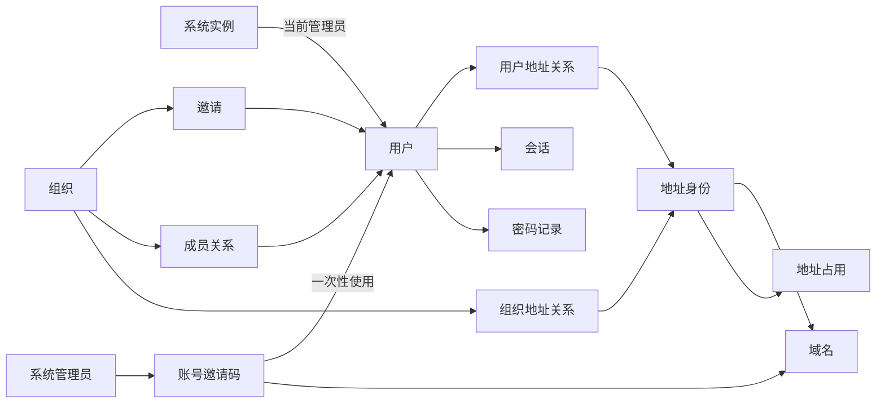

# 澄笺 | Simlettra 数据模型设计总纲

## 文档状态

- 状态：当前，第一批至第六批全部已接受；相关结构已随第一批至第二十七批纵向切片逐步落地
- 建立日期：2026-08-10
- 第一批接受日期：2026-08-10
- 第二批接受日期：2026-08-10
- 第三批接受日期：2026-08-10
- 第四批接受日期：2026-08-10
- 第五批接受日期：2026-08-11
- 第六批原清单接受日期：2026-08-11
- 第六批补充清单接受日期：2026-08-11
- 当前阶段：六批数据模型均已接受，相关结构按纵向切片审查后进入正式迁移；当前正式迁移为 `0001` 至 `0023`
- 需求依据：[需求基线](../需求/需求基线.md)
- 架构依据：[目标架构](../架构/候选目标架构.md)及状态为“已接受”的架构决策记录
- 当前用途：规划正式数据模型的范围、批次和确认方式

## 这份设计解决什么问题

需求文档说明用户能够做什么，数据模型则要回答系统必须长期、准确地记住什么。例如：

- 一个邮箱地址当前属于谁，删除并释放后能否再次使用；
- 同一封邮件发给多个本地地址时，怎样只保存一份内容又让所有有权用户看到；
- 组织成员退出后为什么立即看不到组织邮件，但历史操作仍能保留必要署名；
- 邮件正文对象已经写入而数据库尚未完成时，系统怎样继续恢复而不是显示半封邮件；
- 用户、组织和邮件进入冷静期、垃圾箱或永久删除时，哪些数据仍可恢复，哪些必须清理。

六批设计阶段已经确认对象、归属、关系、状态和删除边界。正式开发阶段不把草案整批照搬到生产，而是随每个纵向切片重新审查所需结构，并通过编号迁移逐步落地；当前邮件接收与完整性相关核心结构已经进入正式迁移 `0007`。

## 已确定的建模边界

以下内容已经由需求基线和架构决策确定，不在本阶段重新选择：

1. D1 保存用户、权限、地址、邮件元数据、状态、任务和审计等权威数据。
2. KV 或 R2 只保存原始 MIME、正文、附件和内嵌资源等不可变邮件对象。
3. 搜索索引、缓存和可重新计算的统计属于派生数据，不作为恢复权威来源。
4. 每封物理邮件与用户看到的邮箱条目分开保存，组织成员的个人整理状态也单独保存。
5. 数据库结构只通过编号 SQL 迁移演进，生产环境只由 Wrangler 应用迁移。
6. 普通查询使用 Drizzle，FTS5、PRAGMA、D1 Sessions 和平台特殊能力使用参数化原生 D1。
7. 跨 D1 与对象存储的写入必须有稳定操作编号、明确状态、幂等重试和对账办法。
8. 永久删除先撤销访问，再由可重试任务清理数据库、对象、搜索和缓存。

## 通用设计原则

### 稳定身份

用户、域名、邮箱地址、组织、成员关系、邮件和任务都使用不向用户暴露含义的稳定内部编号。名称、邮箱地址或显示名称发生状态变化时，历史关系仍通过内部编号保持准确。

### 明确状态

不使用一个含义模糊的“已删除”标记包办所有情况。禁用、暂停、待注销、冷静期、垃圾箱、等待清理和永久完成等状态分别建模，并记录进入时间、恢复期限和完成时间。

### 权威数据与派生数据分离

能够决定所有权、权限、邮件是否可见以及能否恢复的数据属于权威数据。搜索词元、FTS5、缓存和汇总统计可以从权威数据重建，不能反过来决定邮件是否存在。

### 权限从归属关系推导

首发不建立任意组合的通用权限表。个人地址由地址归属决定；组织邮件查看权由当前成员关系决定；组织地址发信权由创建者身份和组织开关共同决定。

### 模块拥有自己的数据

每张权威表只由一个业务模块负责写入。其他模块通过公开应用服务请求操作，不直接修改该模块的内部表。跨模块只引用稳定编号，不传递 Drizzle 查询对象或内部存储类型。

### 时间和排序

系统时间统一保存为 UTC，界面按用户时区显示。需要稳定翻页的列表使用“时间加内部编号”作为排序边界，避免多条记录时间相同时重复或遗漏。

## 数据所有权草图

| 业务模块 | 负责的权威对象 | 可以引用但不能直接修改的对象 |
| --- | --- | --- |
| 系统与初始化 | 系统实例、初始化状态、当前系统管理员、公开设置版本 | 用户、域名、运行任务 |
| 身份与会话 | 用户、密码记录、会话、登录失败状态、注销状态 | 主邮箱地址、组织成员关系 |
| 域名与地址 | 域名、地址身份、地址占用、用户地址关系、地址个人偏好 | 用户、组织、邮件投递 |
| 组织 | 组织、成员关系、邀请、创建者转让、组织发信开关 | 用户、组织地址、组织邮箱条目 |
| 收信 | 收信操作、物理邮件、收件关系、实际投递、拒收结果 | 域名、地址、对象登记 |
| 邮箱 | 邮箱条目、用户整理状态、会话归并、可信发件人设置 | 物理邮件、用户、组织 |
| 草稿与发信 | 草稿、发信操作、收件人投递、供应商尝试和状态事件 | 用户、可用发件地址、邮件对象 |
| 通知与转发 | 通知配置、外部邮箱验证、转发规则、通知和转发尝试 | 用户、地址、物理邮件 |
| 数据生命周期 | 删除操作、恢复期限、导出、备份、恢复、迁移和存储对账 | 所有被处理资源的稳定编号 |
| 运维与审计 | 审计事件、健康状态、告警和用量快照 | 操作者、任务、外部服务配置编号 |

## 关系示意

图中的“地址身份”用于保存一个不可变邮箱地址的历史，“地址占用”用于判断该地址文字当前是否仍被使用或处于保留期。两者分开后，旧邮件可以继续指向原来的地址记录，而已经释放的地址文字仍可在将来重新分配给新的地址身份。

## 确认批次

| 批次 | 主题 | 主要确认内容 | 当前状态 |
| --- | --- | --- | --- |
| 第一批 | 系统身份、用户、域名、地址与组织基础 | 唯一管理员、账号状态、密码与会话、地址全局唯一、地址释放、组织成员与邀请 | 已接受 |
| 第二批 | 物理邮件、投递与邮箱视图 | 邮件、收件人、实际投递、邮箱条目、个人状态、会话关系和未分配来信 | 已接受 |
| 第三批 | 草稿、站内投递与域外发信 | 草稿版本、收件人拆分、每名收件人的状态、供应商事件、幂等和重试 | [已接受](第三批数据模型确认清单.md) |
| 第四批 | 对象登记、收信状态机与后台任务 | 原始 MIME、正文、附件、对象代数、完整性校验、任务租约、补偿和对账 | [已接受](第四批数据模型确认清单.md) |
| 第五批 | 通知、转发与外部服务配置 | 通知通道、外部邮箱验证、转发范围、域名发信路线、加密服务凭据和失败状态 | [已接受](第五批数据模型确认清单.md) |
| 第六批 | 删除、配额、审计、备份与迁移 | 冷静期、垃圾箱、永久清理、配额、审计最小化、备份清单、迁移对账、平台资源用量与域名月度发件配额 | [已接受](第六批数据模型确认清单.md) |

每一批都先形成批量确认清单。用户可以回复“本批全部按推荐”，也可以只列出需要修改的编号。确认后的长期数据决定再写入架构决策记录，之后才形成具体表关系和 SQL 迁移草案。

## 第一批接受结果

用户于 2026-08-10 确认“第一批数据模型全部按推荐”。第一批后续产物为：

1. [0014 分离账号、地址身份与地址占用](../架构决策记录/0014-分离账号地址身份与地址占用.md)。
2. [0015 以显式主体关系维护唯一管理员和组织权限](../架构决策记录/0015-以显式主体关系维护唯一管理员和组织权限.md)。
3. [第一批数据模型设计](第一批数据模型设计.md)。
4. [0001 系统身份与地址基础迁移草案](迁移草案/0001-系统身份与地址基础.sql)。
5. [第一批数据模型迁移草案验证结果](../验证/第一批数据模型迁移草案验证结果.md)。

迁移草案不在正式 `migrations/` 目录中，不属于已经应用的数据库历史。后续仍需结合第二至第六批模型审查引用关系，再决定正式首批迁移的边界。

## 第二批接受结果

用户于 2026-08-10 确认“第二批数据模型全部按推荐”。第二批后续产物为：

1. [第二批数据模型确认清单](第二批数据模型确认清单.md)，数据-19 至数据-37 均为“已确认”。
2. [0016 分离物理邮件、投递、邮箱条目与用户状态](../架构决策记录/0016-分离物理邮件投递邮箱条目与用户状态.md)。
3. [0017 以权威邮件关系重建邮箱范围会话](../架构决策记录/0017-以权威邮件关系重建邮箱范围会话.md)。
4. [0018 以未分配地址时期隔离认领历史](../架构决策记录/0018-以未分配地址时期隔离认领历史.md)。
5. [第二批数据模型设计](第二批数据模型设计.md)。
6. [0002 邮件投递与邮箱视图迁移草案](迁移草案/0002-邮件投递与邮箱视图.sql)。
7. [第二批数据模型迁移草案验证结果](../验证/第二批数据模型迁移草案验证结果.md)。

第二批迁移草案新增 13 张表；与第一批顺序执行后共有 26 张表。48 个本地约束、权限、认领、跨表匹配和删除场景全部通过，外键检查为零。迁移草案仍不在正式 `migrations/` 目录中，不能声称已经成为生产数据库历史。

## 第三批接受结果

用户于 2026-08-10 确认“第三批数据模型全部按推荐”。数据-38 至数据-57 均为“已确认”，本批确定了以下行为：

1. 草稿个人所有权、多设备修订冲突、附件完整性和草稿生命周期；
2. 发送请求防重、发件权限复核、个人与组织已发送条目的归属；
3. 收件人规范化、本地域名站内路由、混合投递和大小预检；
4. 每名收件人的逻辑状态、供应商尝试、每日额度和安全重试；
5. 网关配置版本、供应商事件最小化保存，以及回复和转发关系。

第三批后续产物为：

1. [第三批数据模型确认清单](第三批数据模型确认清单.md)。
2. [0019 以修订号和冲突副本保护服务端草稿](../架构决策记录/0019-以修订号和冲突副本保护服务端草稿.md)。
3. [0020 以单一发送操作协调混合收件人投递](../架构决策记录/0020-以单一发送操作协调混合收件人投递.md)。
4. [0021 以供应商尝试和不可变事件维护域外发信状态](../架构决策记录/0021-以供应商尝试和不可变事件维护域外发信状态.md)。
5. [第三批数据模型设计](第三批数据模型设计.md)。
6. [0003 草稿与发信状态迁移草案](迁移草案/0003-草稿与发信状态.sql)。
7. [第三批数据模型迁移草案验证结果](../验证/第三批数据模型迁移草案验证结果.md)。

第三批迁移草案新增 12 张表；与前两批顺序执行后共有 38 张表。71 项本地结构、约束、跨表匹配、生命周期、幂等、状态历史和删除场景全部通过，外键检查为零。迁移草案仍不在正式 `migrations/` 目录中，不能声称已经成为生产数据库历史。

## 第四批接受结果

用户于 2026-08-10 确认“第四批数据模型全部按推荐”。数据-58 至数据-79 均为“已确认”，本批确定了以下行为：

1. KV 与 R2 共用逐对象、逐部件和逐代数的统一登记，大小与 SHA-256 是内容完整性依据；
2. 收信、发信和迁移邮件分别标记原始 MIME、最终 MIME 或只有结构化内容，邮件完整性成为邮箱可见的独立门槛；
3. 收信使用来源事件或有界指纹防重，并冻结接受时的地址归属或未分配地址时期；
4. 最终收信事务同时建立邮件、对象附着、投递、邮箱、防重和搜索任务，失败时不留下半封可见邮件；
5. 后台任务使用 D1 权威状态、租约、递增领取令牌、尝试历史、重试上限、需处理状态和定时找回；
6. 对象对账分批保存游标，孤立对象经过保护期和两个不同批次确认后才允许安排删除。

第四批后续产物为：

1. [第四批数据模型确认清单](第四批数据模型确认清单.md)。
2. [0022 以统一对象登记和完整性状态管理邮件内容](../架构决策记录/0022-以统一对象登记和完整性状态管理邮件内容.md)。
3. [0023 以有界防重和冻结路由完成可恢复收信](../架构决策记录/0023-以有界防重和冻结路由完成可恢复收信.md)。
4. [0024 以 D1 任务租约和分批对账协调后台工作](../架构决策记录/0024-以D1任务租约和分批对账协调后台工作.md)。
5. [第四批数据模型设计](第四批数据模型设计.md)。
6. [0004 对象、收信与后台任务迁移草案](迁移草案/0004-对象收信与后台任务.sql)。
7. [第四批数据模型迁移草案验证结果](../验证/第四批数据模型迁移草案验证结果.md)。

第四批迁移草案新增 8 张表；与前三批顺序执行后共有 46 张表。63 项本地对象完整性、收信、最终 MIME、任务租约、对账和失败事务断言全部通过，外键检查为零。迁移草案仍不在正式 `migrations/` 目录中，不能声称已经成为生产数据库历史。

## 第五批接受结果

用户于 2026-08-11 确认“第五批数据模型全部按推荐”。数据-80 至数据-98 均为“已确认”，本批确定了以下行为：

1. Provider 与通知凭据使用独立于 `init_key` 的配置加密主密钥加密后保存到 D1；当前系统管理员可以完整管理这些凭据；
2. 首发 Provider 类型只允许 Resend 和 SMTP2GO，Cloudflare Email Sending 已由需求变更 `0004` 与 ADR `0028` 移除；
3. 每个域名使用包含默认和备用 Provider 的版本化路线，执行时冻结完整顺序、配置版本和大小规则；
4. 每名站外收件人独立选择兼容服务，只有明确未接受时才能切换，结果未知时停止自动动作；
5. 通知、外部邮箱验证和个人来信转发分别建立防重操作、尝试历史和最小失败状态；
6. 验证码只保存哈希，自动转发只允许个人地址，并具备重复与环路保护。

第五批后续产物为：

1. [第五批数据模型确认清单](第五批数据模型确认清单.md)。
2. [0025 采用受保护主密钥加密 D1 服务凭据](../架构决策记录/0025-采用受保护主密钥加密D1服务凭据.md)。
3. [0026 采用域名级优先发信路线与安全故障切换](../架构决策记录/0026-采用域名级优先发信路线与安全故障切换.md)。
4. [0027 以独立操作协调通知、外部邮箱验证与来信转发](../架构决策记录/0027-以独立操作协调通知外部邮箱验证与来信转发.md)。
5. [0028 首发域外发信只支持 Resend 和 SMTP2GO](../架构决策记录/0028-首发域外发信只支持Resend和SMTP2GO.md)。
6. [第五批数据模型设计](第五批数据模型设计.md)。
7. [0005 通知、转发与外部连接迁移草案](迁移草案/0005-通知转发与外部连接.sql)。
8. [第五批数据模型迁移草案验证结果](../验证/第五批数据模型迁移草案验证结果.md)。

第五批草案新建 20 张模型表，并重建 4 张带有旧单 Provider 假设的发送核心表；移除被替代的 7 张临时表后，五批顺序执行共建立 63 张表。49 项本地路线、切换、凭据形状、通知、验证、转发、防重与环路断言全部通过，外键检查为零。迁移草案仍不在正式 `migrations/` 目录中，不能声称已经成为生产数据库历史。

## 第六批接受结果

用户于 2026-08-11 确认“第六批数据模型全部按推荐”。数据-99 至数据-128 均为“已确认”，已经确定删除与恢复期限、存储和每日发件配额、审计历史、本地备份、完整恢复、用户导出和旧系统迁移的规则。

同一任务中，用户新增“管理员查看 D1、KV/R2 资源使用情况，以及每个域名当月已发件数量和每月配额”的已确认产品需求。该需求已进入[需求变更-0002](../需求/变更记录/0002-资源用量与域名月度发件配额.md)，并经过[Cloudflare 资源用量接口核验](../验证/Cloudflare资源用量接口核验.md)。

用户随后确认“第六批补充四项及免费资源范围剩余两项全部按推荐”。数据-129 至数据-132 均为“已确认”，分别处理：

1. Cloudflare 资源用量快照；
2. Cloudflare 免费额度作为产品总容量，以及账号级用量、本地估算和保守停止策略；
3. 域名月度发件配额的默认值与逐域名覆盖；
4. 自然月、计数单位、额度预留和失败释放。

第六批后续产物为：

1. [第六批数据模型确认清单](第六批数据模型确认清单.md)。
2. [0031 以恢复窗口和幂等步骤执行永久删除](../架构决策记录/0031-以恢复窗口和幂等步骤执行永久删除.md)。
3. [0032 以用量快照和双重预留管理免费资源与配额](../架构决策记录/0032-以用量快照和双重预留管理免费资源与配额.md)。
4. [0033 以不可变记录和可验证清单完成审计、备份与迁移](../架构决策记录/0033-以不可变记录和可验证清单完成审计备份与迁移.md)。
5. [第六批数据模型设计](第六批数据模型设计.md)。
6. [0006 删除、配额、审计、备份与迁移迁移草案](迁移草案/0006-删除配额审计备份与迁移.sql)。
7. [第六批数据模型迁移草案验证结果](../验证/第六批数据模型迁移草案验证结果.md)。

第六批草案新增 31 张表，六批顺序执行后共建立 94 张表。正式工程随后以 `0016-用户与组织逻辑存储配额.sql` 落地独立的逻辑配额表和触发器。第二十二批配额切片的高保真测试已覆盖默认值、主体覆盖、预留生命周期、失败补偿、收信、草稿、发送和删除。

## 第二十三批导出切片落地结果

第二十三批没有改变第六批已接受的产品范围，而是将 `11.12` 的用户和组织邮件导出落实为正式迁移 `0017-用户与组织邮件导出.sql`。导出范围在创建时冻结，项目和 ZIP 分卷使用独立登记；大导出通过现有后台任务逐卷推进，导出制品计入 KV/R2 平台容量但不计入用户与组织逻辑配额。

相关记录：[0039 以分卷检查点执行邮件导出](../架构决策记录/0039-以分卷检查点执行邮件导出.md)、[第二十三批用户与组织邮件导出](../开发/第二十三批用户与组织邮件导出.md)。

## 第二十四批备份与恢复切片落地结果

第二十四批将 `11.10` 和 `11.11` 落实为正式迁移 `0018-管理员备份与恢复.sql`、管理员在线备份接口和独立本地恢复工具。在线 Worker 负责生成 D1 表分卷、KV/R2 对象分卷与不可变清单；本地工具负责默认加密封装、清单与分卷校验、空白目标导入、对象上传回读和搜索重建收口。

恢复运行使用 `restore_runs`、六个 `restore_checkpoints` 和六项 `restore_checks` 保存证据。D1 导入顺序由正式迁移的真实外键结构计算；可空自引用先置空再回填，不可处理的循环会拒绝计划。由于 D1 外部 SQL 和跨资源恢复不能构成一个原子事务，失败目标必须废弃并从空白资源重新恢复。

相关记录：[0040 以加密本地容器和空白资源分阶段完成完整恢复](../架构决策记录/0040-以加密本地容器和空白资源分阶段完成完整恢复.md)、[第二十四批管理员本地备份与完整恢复](../开发/第二十四批管理员本地备份与完整恢复.md)。

## 第二十七批收信控制与全域认领落地结果

第二十七批将 `5.06` 至 `5.10` 落实为正式迁移 `0021-收信控制与全域认领.sql`。域名、地址和用户暂停，四类拒收规则，未分配地址时期和查看授权均保存为 D1 权威状态；未分配投递使用兼容扩展表保存，避免重建已有 `message_deliveries` 外键链。

第二十九批将 `2.08` 和 `12.11` 的运行健康部分落实为正式迁移 `0022-运行健康与定时维护心跳.sql`。收信、发信、存储和后台任务继续使用各自既有 D1 权威账本，健康模块只执行受管理员权限保护的只读聚合；新增 `scheduled_maintenance_runs` 保存每次 Cron 的运行中、成功或失败状态、受限步骤和安全错误代码。健康数据不复制邮件正文、附件、地址明文或密钥。备份创建时读取 `d1_migrations` 的实际最新版本并冻结到备份账本，确保迁移版本一致的空白恢复规则覆盖后续正式迁移。

第三十八批依据需求变更 `0010` 和 ADR `0046` 将账号邀请码注册落实为正式迁移 `0023-账号邀请码注册.sql`。`account_registration_invitations` 分离用于公开校验的摘要与管理员列表使用的加密副本，冻结绑定域名快照和撤销事实；`account_registration_invitation_consumptions` 以唯一关系保存一次性使用与注册账号快照；`account_registration_rate_limits` 只保存来源 HMAC 摘要。正式注册把用户、密码、主地址、默认额度、会话、使用记录和审计放入同一 D1 原子批次，数据库触发器在最终写入时重新检查邀请码与域名状态。

第三十九批没有改变已接受的数据模型，而是通过 `0024-修复早期逻辑配额表兼容性.sql` 和 `0025-补齐早期内部投递容量拒绝事实.sql` 使早期开发数据库收敛到当前正式结构。迁移保留逻辑配额策略、用量账户、预留和不可变用量账本，把早期共享默认策略按实际主体拆为用户与组织策略，并幂等补齐系统内投递容量拒绝事实。会话详情继续以邮箱条目执行授权和位置过滤，但最终按 `message_id` 展示唯一物理邮件；自发自收的收件箱与已发送条目仍分别存在。

相关记录：[第三十九批早期数据库兼容与会话去重](../开发/第三十九批早期数据库兼容与会话去重.md)、[0025 升级说明](../发布/0025升级说明.md)。

认领在一个 D1 原子批次内创建个人别名、关闭时期、建立历史邮箱条目与实际投递关联、计入逻辑容量并登记搜索和会话重建任务。应用层统一合并已分配投递和认领后的未分配投递。当前本地验证保护线为单个时期 30 封，真实 D1 验证前不把它写成最终产品限制。

相关记录：[0043 以兼容扩展表保存未分配投递](../架构决策记录/0043-以兼容扩展表保存未分配投递.md)、[第二十七批收信控制与全域认领](../开发/第二十七批收信控制与全域认领.md)。
