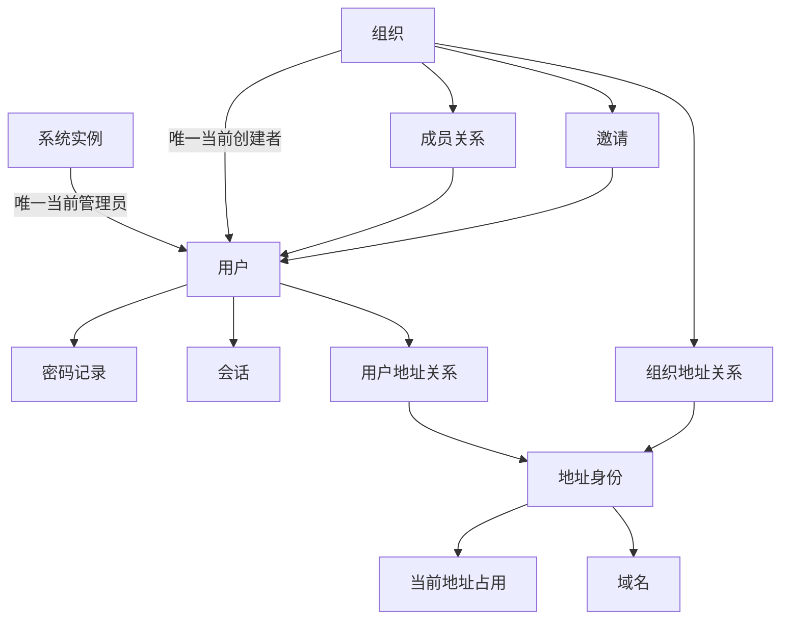

# 澄笺 | Simlettra 第一批数据模型确认清单

## 文档状态

- 状态：已接受
- 建立日期：2026-08-10
- 接受日期：2026-08-10
- 对应阶段：正式数据模型设计
- 依据：[需求基线](../需求/需求基线.md)、[数据模型设计总纲](数据模型设计总纲.md)和状态为“已接受”的架构决策记录
- 本批范围：系统身份、用户、域名、邮箱地址和组织基础关系

## 怎样理解这一批

这一批不要求理解数据库语法。它主要确定五件事：

1. 用户账号和邮箱地址是否是同一个东西；
2. 地址删除后，旧邮件怎样保留历史，同时地址文字又能按规则释放；
3. 系统怎样保证始终只有一名系统管理员；
4. 组织创建者、成员和邀请怎样留下准确关系；
5. 用户失去某个地址的权限时，系统怎样立即停止继续使用该地址。

## 推荐方案

| 编号 | 需要决定的问题 | 推荐方案 | 用户能感受到的结果 | 状态 |
| --- | --- | --- | --- | --- |
| 数据-01 | 名称和邮箱地址能否直接充当内部身份 | 不能；用户、地址、组织和成员关系都使用稳定内部编号，名称只用于显示 | 即使地址以后释放并被重新使用，旧邮件与新使用者也不会混在一起 | 已确认 |
| 数据-02 | 唯一系统管理员怎样保存 | 系统实例只保存一个“当前管理员用户”引用，不在每个用户上保存可重复的管理员角色 | 管理员转让是一次完整替换，数据库中不会意外出现零名或多名管理员 | 已确认 |
| 数据-03 | 用户账号和主邮箱地址是否合并保存 | 分开保存；用户是账号，主邮箱是该用户当前的一项地址关系，登录时由主地址找到用户 | 管理员迁移主地址时不需要重建用户，密码、会话、邮件和组织关系仍属于原账号 | 已确认 |
| 数据-04 | 用户禁用、注销和永久删除怎样区分 | 使用明确状态：“正常”“已禁用”“注销冷静期”“正在永久清理”；分别记录进入时间、恢复期限和完成结果 | 禁用只停用服务并保留数据；注销七天内只能恢复账号；界面不会把两者混为一谈 | 已确认 |
| 数据-05 | 密码和登录会话怎样与用户关联 | 密码记录和会话分别保存；密码记录带算法版本，会话只保存令牌摘要、有效期、最近活动和撤销状态 | 改密可以升级旧参数并选择退出其他设备；数据库泄露时不会直接得到浏览器持有的会话令牌 | 已确认 |
| 数据-06 | 域名怎样避免大小写或显示形式造成重复 | 每个域名同时保存用于显示的值和用于唯一比较的规范值；规范值不可修改，域名状态只区分启用、暂停和待清理，不建立所有权验证状态 | 同一域名不会因为大小写差异被添加两次，暂停域名也不会被误认为已经删除 | 已确认，验证状态由需求变更-0005取代 |
| 数据-07 | 三种邮箱地址怎样保证全局唯一 | 主地址、个人别名和组织地址共用一份“地址身份”登记，再分别关联用户或组织 | 无论地址属于哪一种类型，都不可能同时分给两个对象 | 已确认 |
| 数据-08 | 地址历史和地址释放是否使用同一条记录 | 分开保存“不可变地址身份”和“当前地址占用”；旧邮件引用地址身份，当前占用决定该文字能否再次创建 | 删除别名后，旧邮件仍显示当时的实际投递地址；保留期结束后，相同地址文字可以安全分配给新的地址身份 | 已确认 |
| 数据-09 | 地址大小写怎样处理 | 系统内管理的邮箱地址按不区分大小写比较，并保存一个唯一规范值；用户输入的大小写不能创建第二个地址 | `Alice@example.com` 与 `alice@example.com` 被视为同一地址，减少登录、收信和发信歧义 | 已确认 |
| 数据-10 | 每名用户一个主地址、每个组织一个共享地址怎样保证 | 用户地址关系明确区分“主地址”和“个人别名”，数据库限制每名当前用户只能有一个主地址；组织地址关系限制每个组织只能有一个共享地址 | 不能因为并发操作产生两个主地址或两个组织地址 | 已确认 |
| 数据-11 | 地址名称、排序、默认发件人与签名是否放在地址本身 | 地址本身只保存稳定身份和公共说明；置顶、排序、默认发件地址、发件显示名称和签名按“用户加地址”单独保存 | 多名成员使用同一组织地址时，可以有自己的排序和签名，不会互相覆盖 | 已确认 |
| 数据-12 | 组织创建者和成员怎样保存 | 组织只保存一名当前创建者；每次加入组织建立一段成员关系并记录加入、退出时间，创建者本人也必须是当前成员 | 成员退出后立即失去访问权；退出后再次加入会形成新的成员记录，历史时间不会被改写 | 已确认 |
| 数据-13 | 创建者转让怎样执行 | 只能转给当前有效成员，并在同一个数据库事务中替换创建者；原创建者默认继续作为普通成员，除非本次操作同时是退出 | 转让过程中组织始终有且只有一名创建者，不会出现无人管理的短暂状态 | 已确认 |
| 数据-14 | 邀请和邀请偏好怎样保存 | 用户保存一种邀请偏好；每次邀请保存独立记录及“待确认、已接受、已拒绝、已撤销”状态，同一组织对同一用户同时最多一份待处理邀请 | 自动接受和拒绝都能留下结果；重复点击或重复请求不会生成多个成员身份 | 已确认 |
| 数据-15 | 是否建立可任意配置的通用权限表 | 首发不建立；个人地址权限来自所有者，组织查看权来自当前成员关系，组织发信权来自创建者身份或组织的成员发信开关 | 权限规则与已确认产品行为一致，管理员不会面对难以理解的权限矩阵 | 已确认 |
| 数据-16 | 用户失去地址权限时，默认发件设置怎样处理 | 退出组织、组织关闭成员发信或地址停用时，立即停止该地址发信权限；若它是默认发件地址，则自动回退到用户主地址并记录审计事件 | 用户不会在权限已经失效后继续误用组织地址，下一次写信仍有可用的默认地址 | 已确认 |
| 数据-17 | 管理员迁移用户主地址时怎样处理旧地址 | 迁移创建新的地址身份并原子切换主地址；管理员必须明确选择将旧地址保留为个人别名，或停用并按个人别名保留期释放，系统不静默删除 | 迁移不会改变旧地址文字，也不会意外丢掉旧地址来信；旧地址的去向在操作前清楚可见 | 已确认 |
| 数据-18 | 删除或退出后是否直接抹掉成员关系和操作人 | 不直接抹掉历史关系；退出立即撤销访问，但历史操作保留稳定操作人编号和当时的必要显示名称。账号永久删除后改为不含邮箱地址的“已删除用户”署名 | 组织历史仍能分辨操作来源，同时不会在永久删除后继续公开原邮箱地址 | 已确认 |

## 推荐的数据关系

## 关键事务边界

本批推荐把以下操作作为不可拆开的数据库事务：

1. 初始化系统、创建首名用户、设置唯一管理员、创建主地址和首个域名。
2. 创建用户、创建主地址并建立当前地址占用。
3. 创建组织、建立创建者成员关系、创建组织地址并占用地址文字。
4. 接受组织邀请并建立唯一当前成员关系。
5. 转让系统管理员或组织创建者。
6. 迁移用户主地址并处理旧地址去向。
7. 删除别名、进入保留期或释放地址占用。

任一事务失败时全部回滚，不能留下“有用户但没有主地址”“有组织但没有创建者”或“地址已经占用但没有归属”的半成品。

## 本批不决定的内容

以下内容留给后续批次，不应因为本批出现相关编号就被提前视为已确定：

1. 物理邮件、投递、邮箱条目和成员整理状态的具体字段。
2. 邮件正文、附件和原始 MIME 的对象键结构。
3. 草稿、站内投递、域外发信和每名收件人的状态表。
4. 通知、转发、备份、迁移、配额、审计和后台任务的完整结构。
5. 邮箱地址字符范围已经由需求变更-0006和 ADR `0035` 收口：首发采用 ASCII 邮箱前缀、统一小写和 IDNA/Punycode 域名规范化。

## 确认记录

用户于 2026-08-10 确认：“第一批数据模型全部按推荐”。数据-01 至数据-18 均已确认。

对应长期决定记录于：

1. [0014 分离账号、地址身份与地址占用](../架构决策记录/0014-分离账号地址身份与地址占用.md)。
2. [0015 以显式主体关系维护唯一管理员和组织权限](../架构决策记录/0015-以显式主体关系维护唯一管理员和组织权限.md)。
