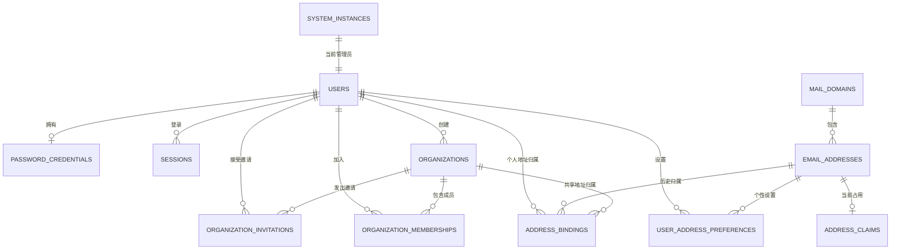

# 澄笺 | Simlettra 第一批数据模型设计

## 文档状态

- 状态：当前，已接受
- 建立日期：2026-08-10
- 接受日期：2026-08-10
- 对应确认：[第一批数据模型确认清单](第一批数据模型确认清单.md)
- 对应决策：[0014 分离账号、地址身份与地址占用](../架构决策记录/0014-分离账号地址身份与地址占用.md)、[0015 以显式主体关系维护唯一管理员和组织权限](../架构决策记录/0015-以显式主体关系维护唯一管理员和组织权限.md)
- 变更依据：[需求变更-0005：应用不重复验证邮件域名所有权](../需求/变更记录/0005-应用不重复验证邮件域名所有权.md)、[0034 不在应用内重复验证邮件域名所有权](../架构决策记录/0034-不在应用内重复验证邮件域名所有权.md)、[需求变更-0006：确定首发邮箱地址字符规则](../需求/变更记录/0006-确定首发邮箱地址字符规则.md)、[0035 采用 ASCII 邮箱前缀与 IDNA 域名规范化](../架构决策记录/0035-采用ASCII邮箱前缀与IDNA域名规范化.md)
- 迁移草案：[0001 系统身份与地址基础](迁移草案/0001-系统身份与地址基础.sql)
- 验证结果：[第一批数据模型迁移草案验证结果](../验证/第一批数据模型迁移草案验证结果.md)

## 设计范围

本设计把数据-01 至数据-18 转换成具体的 D1 表关系、唯一约束和事务边界。它只覆盖系统身份、用户、域名、地址、密码、会话和组织基础，不提前确定邮件、对象、草稿、发信、通知、备份和迁移表。

迁移草案用于验证结构是否能够表达已接受决定。它尚未进入正式 `migrations/`，不能直接作为生产升级历史。

## 表与模块所有权

| 表 | 所属模块 | 保存内容 | 权威性 |
| --- | --- | --- | --- |
| `system_instances` | 系统与初始化 | 初始化完成时间、存储模式和唯一当前系统管理员 | 权威 |
| `users` | 身份与会话 | 稳定用户身份、显示名称、时区、邀请偏好和账号生命周期 | 权威 |
| `password_credentials` | 身份与会话 | 版本化密码哈希参数、临时密码和强制改密状态 | 权威、敏感 |
| `sessions` | 身份与会话 | 会话令牌摘要、CSRF 摘要、有效期、最近活动和撤销状态 | 权威、敏感 |
| `login_rate_limits` | 身份与会话 | 按账号或来源计算的登录失败窗口和阻止期限 | 可过期的安全状态 |
| `mail_domains` | 域名与地址 | 规范域名、显示名称、启用或暂停状态、全域收信模式 | 权威 |
| `email_addresses` | 域名与地址 | 不可变地址身份、规范地址、显示地址和公共说明 | 权威 |
| `address_claims` | 域名与地址 | 某个规范地址当前处于使用中还是保留期 | 权威 |
| `address_bindings` | 域名与地址 | 地址在一段时间内属于某个用户或组织，以及主地址、别名或共享地址角色 | 权威 |
| `user_address_preferences` | 域名与地址 | 每名用户对可用地址的置顶、排序、默认发件、显示名称和签名 | 权威 |
| `organizations` | 组织 | 组织名称、唯一创建者、成员发信开关和删除冷静期 | 权威 |
| `organization_memberships` | 组织 | 每次加入与退出形成的一段成员关系 | 权威 |
| `organization_invitations` | 组织 | 邀请对象、发起者、处理状态和接受后产生的成员关系 | 权威 |

账号注册邀请码属于已确认需求；其最终规则已由后续需求变更 `0010` 确定，并由独立纵向切片建立对应结构，不把组织邀请表复用于账号注册。

## 核心关系

## 关键唯一约束

1. `system_instances` 只允许编号为 `1` 的一行；初始化完成后其管理员引用不能为空。
2. `mail_domains.canonical_name` 全局唯一，域名显示形式不能绕过唯一性。
3. `address_claims.canonical_address` 是整个系统当前地址命名空间的唯一键。
4. 一个地址身份同时最多有一段未结束的 `address_bindings`。
5. 每名用户同时最多有一个角色为 `primary` 的当前地址归属。
6. 每个组织同时最多有一个角色为 `shared` 的当前地址归属。
7. 同一用户在同一组织同时最多有一段未退出的成员关系。
8. 同一组织对同一用户同时最多有一份待处理邀请。
9. 每名用户同时最多有一个默认发件地址。
10. 会话令牌摘要全局唯一，原始会话令牌不写入 D1。

这些约束保证“最多一个”。“活动用户必须恰好有主地址”“活动组织必须恰好有共享地址和创建者成员关系”等跨表规则，由应用事务、初始化检查和契约测试保证。

## 状态和值域

| 对象 | 允许状态或类型 | 说明 |
| --- | --- | --- |
| 用户 | `active`、`disabled`、`deletion_pending`、`deleting`、`deleted` | `deleted` 只保留非个人化稳定编号和“已删除用户”署名 |
| 域名 | `active`、`paused`、`deleting` | 管理员添加后直接启用；仍有关联地址或邮件时不能进入最终删除 |
| 地址占用 | `active`、`reserved` | `reserved` 必须有释放时间；释放完成后删除占用行 |
| 地址归属 | `primary`、`alias`、`shared` | 结束时间为空代表当前归属 |
| 组织 | `active`、`deletion_pending`、`deleting` | 七天恢复期使用 `deletion_pending` |
| 邀请 | `pending`、`accepted`、`rejected`、`revoked` | 接受后可以引用产生的成员关系 |
| 邀请偏好 | `reject_all`、`manual`、`auto_accept` | 默认 `manual` |
| 登录限速范围 | `account`、`source` | 范围键只保存摘要，不保存密码或令牌 |

## 关键事务

### 初始化

在一个 D1 事务或具有整体回滚语义的 `batch()` 中：

1. 创建首名用户和密码记录。
2. 创建首个域名、地址身份、地址占用和主地址归属。
3. 创建系统单例并引用首名用户作为管理员。
4. 完成后执行“管理员为活动用户、用户有一个主地址、地址占用与归属一致”的检查。

### 创建用户

创建用户、密码记录、主地址身份、地址占用和主地址归属必须整体成功。不能先暴露一个没有主地址的活动用户。

### 创建组织

创建组织、创建者成员关系、共享地址身份、地址占用和组织地址归属必须整体成功。组织地址冲突时整项操作失败。

### 主地址迁移

1. 锁定并验证旧主地址归属仍为当前值。
2. 创建并占用新地址身份。
3. 结束旧主地址归属并建立新主地址归属。
4. 按管理员选择把旧地址改为个人别名，或结束归属并进入保留期。
5. 检查用户仍恰好有一个当前主地址后提交。

### 组织创建者转让与退出

继任者必须是活动用户和当前组织成员。转让先替换 `organizations.creator_user_id`，再按操作目的保留或结束原创建者成员关系。创建者退出且只剩一人时不走转让，而进入组织删除流程。

### 权限失效

退出组织、用户禁用或待注销、域名或地址暂停、组织关闭成员发信时，服务端权限立即失效。若失效地址是默认发件地址，同一业务操作把默认值回退到当前主地址并记录待后续审计模块保存的事件。

## 删除与历史

1. 用户禁用不删除密码之外的数据，但撤销全部会话并停止登录和收发。
2. 用户进入注销冷静期后撤销会话、停止地址使用并立即终止普通组织成员访问。
3. 用户永久清理完成后删除密码、会话、地址个人设置和个人邮件；用户行变成最小 `deleted` 占位，显示名称统一改为“已删除用户”，时区等个人偏好恢复为非识别性默认值。
4. 地址归属结束后保留历史行。地址占用按保留期删除，地址身份在仍被邮件或审计引用时继续存在。
5. 组织成员退出只结束当前成员关系，不删除历史。组织永久删除时，组织及成员关系可以在必要审计另行保存后清理。
6. 本批只定义身份层边界，邮件、搜索和对象的具体永久清理顺序在第六批统一确认。

## 仍未确认的事项

以下内容不是第一批已接受结论：

1. 账号注册邀请码规则原为待确认事项，现已由需求变更 `0010` 取代：一人一次、无时间期限、绑定管理员指定域名并在成功注册或撤销后失效。
2. 用户别名、组织数量、每日发信和存储配额的默认值与覆盖层级。
3. 审计事件保存时间以及“必要显示名称”快照的精确保留范围。

这些事项必须在后续清单中明确确认，不能从迁移草案中的预留能力反推产品行为。

## 验证要求

1. 从空数据库执行迁移草案，`foreign_key_check` 返回零条结果。
2. 验证规范域名、地址占用、当前主地址、当前组织地址、当前成员和待处理邀请的唯一约束。
3. 验证大小写不同的同一规范地址不能同时占用。
4. 验证地址释放后可以创建新的地址身份，旧归属仍指向旧身份。
5. 验证创建用户、创建组织、主地址迁移和创建者转让的失败回滚。
6. 验证已删除用户占位不含原邮箱地址、密码、会话或个人设置。
7. 验证普通成员、创建者、已退出成员和已禁用用户的权限查询结果。

本地结构验证已于 2026-08-10 完成：迁移草案成功建立 13 张表，17 个约束和恢复场景全部通过，外键检查为零。创建用户、创建组织、主地址迁移和完整权限查询仍需在应用服务实现后继续验证。
