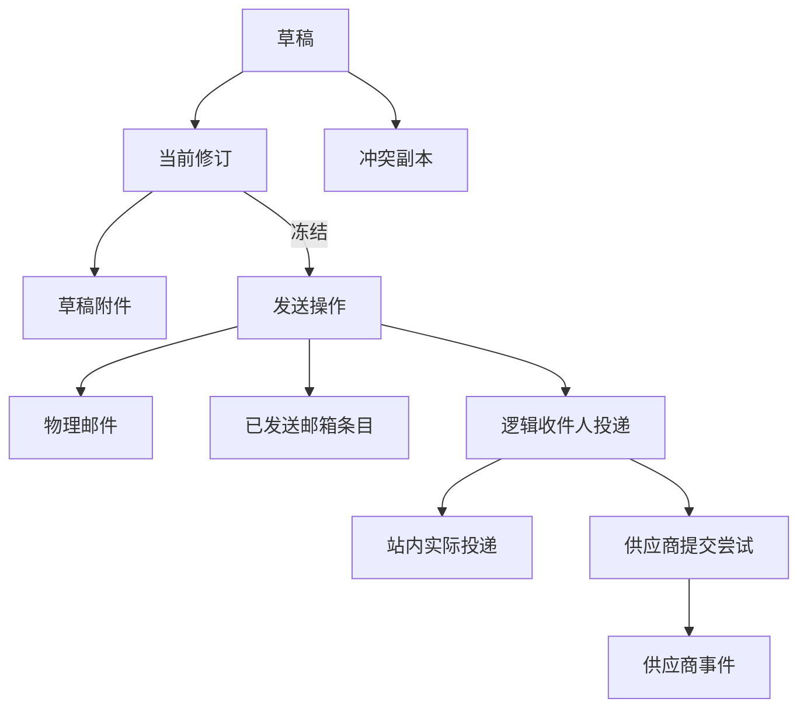

# 澄笺 | Simlettra 第三批数据模型确认清单

## 文档状态

- 状态：当前，已接受
- 建立日期：2026-08-10
- 接受日期：2026-08-10
- 对应阶段：正式数据模型设计
- 依据：[需求基线](../需求/需求基线.md)、[数据模型设计总纲](数据模型设计总纲.md)和状态为“已接受”的架构决策记录
- 对应决策：[0019 以修订号和冲突副本保护服务端草稿](../架构决策记录/0019-以修订号和冲突副本保护服务端草稿.md)、[0020 以单一发送操作协调混合收件人投递](../架构决策记录/0020-以单一发送操作协调混合收件人投递.md)、[0021 以供应商尝试和不可变事件维护域外发信状态](../架构决策记录/0021-以供应商尝试和不可变事件维护域外发信状态.md)
- 具体设计：[第三批数据模型设计](第三批数据模型设计.md)
- 迁移草案：[0003 草稿与发信状态](迁移草案/0003-草稿与发信状态.sql)
- 验证结果：[第三批数据模型迁移草案验证结果](../验证/第三批数据模型迁移草案验证结果.md)
- 本批范围：草稿、发送操作、站内与站外收件人、供应商尝试、状态事件、幂等和重试

> 后续变更：需求变更 `0004` 与 ADR `0028` 已移除 Cloudflare Email Sending。当前首发只支持 Resend 和 SMTP2GO；本批关于逐收件人状态、Resend 幂等和结果未知不自动重发的其余结论继续有效。

## 怎样理解这一批

这一批确定用户按下“发送”前后，系统怎样避免覆盖草稿、漏发或重复发信。主要回答：

1. 两台设备同时编辑同一草稿时，哪一份内容被保留；
2. 使用组织地址编写的草稿是否会被其他成员看见；
3. 同一封邮件同时包含系统内和站外收件人时，怎样仍然只显示一封已发送邮件；
4. 某个收件人失败或状态未知时，怎样重试而不再次发送给已经成功的人；
5. 供应商回调重复、乱序或无法匹配时，哪些状态可以改变。

用户已经接受本批全部推荐；下表保留当时的确认问题、推荐结果和最终状态，供后续实现与变更追踪使用。

## 已经确定的边界

以下内容已经由需求基线或已接受的架构决策确定，本批不重复选择：

1. 草稿和草稿附件保存到服务端，浏览器本地内容只能作为短期编辑缓存。
2. 一次发送可以同时包含系统内和站外收件人；系统内直接投递，站外通过发件域名配置的网关投递，用户仍看到一封已发送邮件。
3. 每名站外收件人独立保存等待提交、提交中、已提交、延迟、已送达、退信、失败和结果未知。
4. 单封邮件按照最终完整邮件字节计算，实际限制取 Simlettra、供应商和收件条件的较小值。
5. Resend 在 24 小时内复用稳定幂等键；SMTP2GO 结果未知时不自动重发。
6. 供应商事件必须先验证来源，再按事件编号去重；旧事件不能使终态倒退，投诉单独记录，打开和点击不作为已读。
7. 用户只能使用本人拥有或明确获准使用的发件地址；普通用户不能读取供应商密钥。
8. 首发不提供定时发送、撤回、已读回执、模板和营销群发。

## 推荐方案

| 编号 | 需要决定的问题 | 推荐方案 | 用户能感受到的结果 | 状态 |
| --- | --- | --- | --- | --- |
| 数据-38 | 使用组织地址写信时，草稿属于个人还是组织 | 所有草稿都属于实际编辑者个人；选择组织地址只表示计划使用该地址发送，其他组织成员在邮件真正发送前不能看到草稿 | 家庭或团队成员不会看到尚未完成的内容，发送后才进入组织已发送邮件 | 已确认 |
| 数据-39 | 两台设备同时保存同一草稿时是否采用最后写入者覆盖 | 不采用；草稿保存当前修订号，每次自动保存必须带上编辑时看到的修订号。过期设备不能覆盖新内容，系统把其不同内容保存为可恢复的“冲突副本”；重复的同一次自动保存不会反复产生副本 | 多设备编辑不会静默丢字，出现冲突时两份内容都能找回 | 已确认 |
| 数据-40 | 是否永久保存每一次自动保存历史 | 不保存完整编辑历史；只保存当前草稿、必要的冲突副本和发送时冻结的最终快照 | 不会因频繁自动保存无限占用空间，同时发送出去的内容仍有不可修改的准确版本 | 已确认 |
| 数据-41 | 尚未上传完成的附件能否进入草稿或被发送 | 附件上传完成并通过大小与完整性校验后，才加入某个草稿修订；上传中或失败的附件不属于可发送快照。删除附件也必须产生新的草稿修订 | 跨设备看到的附件列表一致，不会发出只有文件名但内容缺失的附件 | 已确认 |
| 数据-42 | 删除草稿和成功发送后的草稿怎样处理 | 用户丢弃草稿时先进入垃圾箱，按 30 天规则恢复或清理；发送操作被系统正式接受后，草稿标记为已使用并退出草稿箱，不再额外产生一份垃圾箱副本 | 误删草稿可以恢复；已经发送的内容只在已发送邮件中保留，不会留下重复草稿 | 已确认 |
| 数据-43 | 草稿选择的发件地址后来失效怎么办 | 草稿内容和附件继续保留，但发送时必须重新检查用户、地址、域名和组织发信权限；失效时阻止发送，并要求改选仍有权使用的地址 | 退出组织或管理员关闭成员发信后不会丢草稿，也不能借旧草稿继续使用组织地址 | 已确认 |
| 数据-44 | 双击发送、网络重试或过期草稿版本怎样处理 | 每次发送请求带稳定请求编号和预期草稿修订；同一请求编号只创建一个发送操作。草稿已被其他设备更新时拒绝发送旧版本；任何确定性检查失败都保留可编辑草稿，且不创建已发送邮件 | 重复点击不会发出两封邮件，也不会误把旧设备上的内容发送出去 | 已确认 |
| 数据-45 | 发送操作已接受后，权限被撤销是否继续提交尚未发送的站外收件人 | 系统内收件人在接受发送的 D1 事务中直接投递；每次尚未提交的站外尝试和安全重试前，重新检查用户、发件地址、域名及组织权限。权限已撤销时停止剩余提交并记录失败；已经站内送达或已被供应商接受的部分不能撤回 | 管理员禁用用户或关闭组织发信后，尚未真正提交的外部邮件会停下，但已经送达的收件人不会被伪装成未发送 | 已确认 |
| 数据-46 | 使用个人地址和组织地址发送后，已发送邮件分别出现在哪里 | 个人地址发送只建立个人已发送条目；组织地址发送只建立组织已发送条目，并记录实际操作人。当前组织成员都能查看，操作人不再获得一条重复的个人副本 | 组织通信集中保留在组织邮箱，个人邮箱不会同时出现内容相同的第二条已发送邮件 | 已确认 |
| 数据-47 | 同一地址同时出现在收件人、抄送或密送中是否发送多次 | 不发送多次；发送前按安全的邮箱地址规范化规则合并相同地址，角色优先级为收件人高于抄送、抄送高于密送，同一角色保留首次出现顺序。外部地址只做标准允许的规范化，不猜测特定服务商的别名规则 | 同一人只收到一封，地址出现在可见收件人中时不会又被当作密送对象 | 已确认 |
| 数据-48 | 本系统管理域名下的地址能否绕到域外发信网关 | 不能；已创建地址直接站内投递，启用全域收信的未知地址进入未分配来信，其他暂停、禁用或不存在的本地域名地址在发送前报错。只有不属于本系统管理域名的地址才进入域外网关 | 自有域名邮件不会绕外部服务一圈再回来，也不会因地址不存在而意外发往站外 | 已确认 |
| 数据-49 | 发送前发现某个确定无效的收件人时，是否仍向其他人发送 | 不发送；地址语法错误、本地域名地址不可投递、没有收件人、发件权限失效或大小超限等可预先判断的问题，会阻止整次发送并保留草稿。发送正式接受后才发生的网络、供应商或收件方失败，按收件人分别记录，不回滚已经成功的部分 | 明知名单有错误时不会只发给一部分人；真正发送后的外部故障仍能逐人看到结果 | 已确认 |
| 数据-50 | 混合发送需要几封物理邮件和几个整体状态 | 一次用户操作建立一个发送操作、一封不可修改的物理邮件和一个个人或组织已发送条目；每个最终收件人建立独立逻辑投递。整封邮件的“发送中、全部完成、部分失败、全部失败或存在未知”由收件人状态汇总计算，不作为覆盖各收件人结果的另一份权威状态 | 页面仍显示一封已发送邮件，并能展开查看每个地址的真实结果 | 已确认 |
| 数据-51 | 供应商一次提交多个收件人时，是否合并收件人状态 | 不合并；每个最终收件人始终有独立逻辑投递。供应商适配器可以把兼容收件人放入同一次提交尝试，但必须记录尝试与收件人的对应关系，重试时不能再次包含已经进入终态的收件人 | 供应商如何批量提交不会让某个人的退信覆盖其他人的送达，也不会重发给成功收件人 | 已确认 |
| 数据-52 | 多收件人邮件的大小上限怎样执行 | 在接受发送前生成或测量最终不可修改负载，并采用所有站外收件人条件中的最严格上限；只要其中一名收件人的有效上限更小且邮件超限，整次发送都不开始，系统内收件人也不会先收到 | 不会出现附件过大时内部人员已经收到、外部人员却完全没发送的半完成情况 | 已确认 |
| 数据-53 | 管理员设置的每日发件数量按邮件数还是收件人数计算 | 按去重后的最终收件人数计算，系统内和站外都计入；发送操作接受时一次性占用额度。重复点击、安全重试和供应商重复事件不重复计数，发送前被拒绝也不计数 | 一封发给五个人的邮件占用五次额度，避免通过大量密送绕过防滥用限制 | 已确认 |
| 数据-54 | 安全重试、失败后重试和结果未知后的再次发送是否使用同一种记录 | 不是；可以证明未提交的临时失败在同一收件人逻辑投递下追加尝试；Resend 在有效期内复用同一幂等键。SMTP2GO 的结果未知不自动重发；用户确认风险后再次发送时创建新的发送操作，只包含选中的收件人，并明确关联原操作 | 正常临时故障可以自动恢复，无法证明结果时不会把一次新发送伪装成普通重试 | 已确认 |
| 数据-55 | 管理员修改发信网关配置后，正在处理的邮件使用新配置还是原配置 | 每个发送操作冻结供应商类型、配置版本和当时采用的大小规则，普通配置修改只影响新操作；密钥只保存受保护配置引用，不复制进 D1。管理员显式停用网关是紧急停止信号，尚未提交的尝试暂停并等待处理 | 同一封邮件的重试不会中途换供应商或换限制，管理员仍能在紧急情况下停止继续外发 | 已确认 |
| 数据-56 | 供应商回调原文是否长期完整保存 | 不长期保存完整原文；鉴权成功后保存供应商事件编号、规范事件类型、发生时间、接收时间、关联收件人、有限诊断信息和原文摘要。无法匹配的已验证事件进入待对账状态并告警，鉴权失败或重复事件不能改变投递状态 | 日志和数据库不会无必要地长期复制供应商回调中的邮箱信息，同时异常事件仍可追踪 | 已确认 |
| 数据-57 | 回复、回复全部和转发怎样保存关系 | 草稿保存“新邮件、回复、回复全部或转发”来源及原邮件编号；回复和回复全部发送后建立明确父邮件关系及标准关系头。转发只保留来源说明，不自动加入原会话。用户编辑收件人不会抹掉已经选择的回复关系 | 回复会留在正确会话中，转发则作为新的会话开始，同时仍能知道它来源于哪封邮件 | 已确认 |

## 推荐的数据关系

## 推荐的关键事务边界

本批建议把以下操作作为不可拆开的数据库事务或具有明确跨资源状态机的操作：

1. 自动保存时检查预期修订号，并更新当前草稿或建立冲突副本。
2. 接受发送时冻结草稿修订、占用每日额度、创建发送操作、物理邮件、收件人逻辑投递和唯一已发送条目。
3. 同一接受事务中完成全部系统内投递，并为站外收件人登记待处理任务；任一确定性预检失败时全部不开始。
4. 每次供应商提交先登记尝试，再调用外部服务；响应、超时和后续事件只能按照允许的状态迁移更新相关收件人。
5. 供应商事件先完成来源验证和事件编号去重，再更新事件记录和收件人状态。
6. 用户对“结果未知”执行再次发送时，创建关联原操作的新发送操作，不能修改原投递历史。

## 本批不决定的内容

以下内容留给后续批次或实现阶段：

1. 草稿正文、附件、最终 MIME 和内嵌资源的具体对象键及对象登记字段。
2. Queue 任务租约、重试退避、死信、定时修复和跨资源补偿表的统一结构。
3. Resend 与 SMTP2GO 的发信网关配置、加密凭据和域名映射正式表结构；这些已在第五批与其他外部服务配置一起设计。
4. 用户与组织存储配额、每日额度的具体默认数值，以及管理员界面的视觉表现。
5. “结果未知”提醒用户或管理员的具体等待时间。
6. 每封邮件允许的最大收件人数；当前需求基线尚未给出该数值，不能从每日额度规则反推。

## 确认记录

用户于 2026-08-10 确认“第三批数据模型全部按推荐”。数据-38 至数据-57 均已确认，并由 ADR `0019` 至 `0021`、第三批具体设计和 `0003` 迁移草案承接。

本批决定现在属于正式数据模型事实。后续若改变草稿冲突、混合发送、逐收件人状态、幂等或供应商事件规则，必须建立新的架构决策记录取代现有结论，并同步修改设计、迁移和验证文档。
