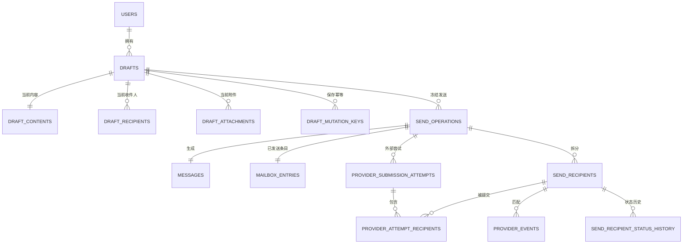

# 澄笺 | Simlettra 第三批数据模型设计

## 文档状态

- 状态：当前，已接受
- 建立日期：2026-08-10
- 接受日期：2026-08-10
- 对应确认：[第三批数据模型确认清单](第三批数据模型确认清单.md)
- 对应决策：[0019 以修订号和冲突副本保护服务端草稿](../架构决策记录/0019-以修订号和冲突副本保护服务端草稿.md)、[0020 以单一发送操作协调混合收件人投递](../架构决策记录/0020-以单一发送操作协调混合收件人投递.md)、[0021 以供应商尝试和不可变事件维护域外发信状态](../架构决策记录/0021-以供应商尝试和不可变事件维护域外发信状态.md)
- 迁移草案：[0003 草稿与发信状态](迁移草案/0003-草稿与发信状态.sql)
- 验证结果：[第三批数据模型迁移草案验证结果](../验证/第三批数据模型迁移草案验证结果.md)

## 设计范围

本设计把数据-38 至数据-57 转换成具体的 D1 表关系、唯一约束和状态边界。它覆盖草稿当前修订、冲突副本、草稿收件人与已完成附件、发送请求防重、发送操作、逐收件人逻辑投递、每日额度单位、供应商尝试、供应商事件和状态历史。

正文、HTML、附件与最终 MIME 的对象登记仍由第四批统一设计；发信网关配置和密钥引用的正式表由第五批设计；每日额度的日期窗口与默认数值由第六批配额模型补充。因此，本批只保存能够稳定衔接这些后续模型的身份、版本和快照，不提前建立不完整配置表。

## 表与模块所有权

| 表 | 所属模块 | 保存内容 | 权威性 |
| --- | --- | --- | --- |
| `drafts` | 草稿与发信 | 草稿所有者、状态、发件地址意图、来源邮件、当前修订和冲突来源 | 权威 |
| `draft_contents` | 草稿与发信 | 每个草稿唯一的当前主题、正文格式、内容代数与修订号 | 权威当前状态 |
| `draft_recipients` | 草稿与发信 | 当前修订中的收件人、抄送和密送顺序 | 权威当前状态 |
| `draft_attachments` | 草稿与发信 | 已完成并通过校验、属于当前修订的附件元数据 | 权威关系；对象内容由第四批登记 |
| `draft_mutation_keys` | 草稿与发信 | 自动保存变更编号及其保存或冲突结果 | 最小幂等记录 |
| `send_operations` | 草稿与发信 | 一次已接受发送的操作者、发件上下文、物理邮件、已发送条目、快照与工作状态 | 权威 |
| `send_idempotency_keys` | 草稿与发信 | 用户发送请求编号、输入摘要和原操作结果 | 最小幂等记录 |
| `send_recipients` | 草稿与发信 | 每个去重后最终收件人的角色、路由通道和统一投递状态 | 权威用户结果 |
| `provider_submission_attempts` | 域外发信网关 | 每次外部调用前登记的供应商、配置版本、负载摘要和结果 | 权威副作用账本 |
| `provider_attempt_recipients` | 域外发信网关 | 一次供应商尝试包含哪些逻辑收件人 | 权威关系 |
| `provider_events` | 域外发信网关 | 已验证供应商事件的最小不可变记录、匹配和处理结果 | 权威事件账本 |
| `send_recipient_status_history` | 草稿与发信 | 每次逻辑收件人状态迁移及来源 | 权威历史 |

## 核心关系

## 草稿当前状态

`drafts` 是草稿身份和生命周期，`draft_contents`、`draft_recipients` 与 `draft_attachments` 共同构成唯一当前修订。它们不保存完整自动保存历史。

草稿状态如下：

| 状态 | 含义 |
| --- | --- |
| `active` | 在草稿箱中可编辑 |
| `trashed` | 已进入垃圾箱，在到期前可恢复 |
| `consumed` | 某个发送操作已经接受该修订，不再作为草稿显示 |
| `deleting` | 保留期结束，等待对象和关系清理 |

每个草稿保存 `current_revision_number`。当前内容、收件人和附件行也带同一修订号，自动保存事务必须整体替换并在提交前检查一致。草稿发件地址使用不可变地址身份引用，允许该地址当前权限失效后继续保留内容。

新邮件的来源为空。回复、回复全部和转发保存来源物理邮件编号与稳定来源引用；来源物理邮件被清理后，引用文字继续保留。回复发送时写入第二批 `message_relations`，转发只保留来源说明。

## 自动保存与冲突副本

每次自动保存提交：

1. 草稿编号、稳定变更摘要、预期修订号和完整当前编辑输入摘要；
2. 当前主题、正文格式、正文内容代数、收件人列表和已完成附件列表；
3. 用户仍是草稿所有者且草稿状态为 `active`。

`draft_mutation_keys` 以“原草稿加变更摘要”为唯一键，记录结果是更新原草稿还是建立冲突副本，以及结果草稿和修订号。同一请求重放只返回该结果。

预期修订等于当前修订时，在一个事务中更新当前内容、替换收件人和附件关系并增加修订号。预期修订过期且输入摘要不同，则创建 `conflict_parent_draft_id` 指向原草稿的新活动草稿。冲突副本属于同一用户，具有独立当前修订和生命周期。

## 草稿附件边界

`draft_attachments` 只登记已经完成且哈希校验通过的附件。上传中、失败或等待对象一致性的记录属于第四批对象与任务状态，不能写入当前修订附件表。

每条附件保存不可信原始文件名、媒体类型、大小、SHA-256、显示顺序和内容代数。对象存储键不会直接暴露给浏览器；第四批使用附件稳定编号作为对象登记所有者。

## 接受发送

发送操作不存在“半接受”状态。确定性预检全部通过后，在一个 D1 事务中：

1. 用用户范围幂等键占用发送请求，并验证输入摘要和草稿修订。
2. 验证操作者、发件地址、域名和组织权限。
3. 规范化并去重收件人，解析所有本地域名路由，计算最终收件人数与额度单位。
4. 验证最终内容对象完整，测量不可修改负载并应用最严格有效上限。
5. 创建物理邮件、邮件头地址和回复关系。
6. 创建发送操作、每名收件人的逻辑投递和唯一个人或组织已发送邮箱条目。
7. 完成全部系统内实际投递和收件邮箱条目。
8. 为站外收件人登记等待提交状态和后台任务。
9. 把来源草稿改为 `consumed`，提交后才向用户返回发送已接受。

任一步失败时全部回滚，草稿保持可编辑且每日额度不增加。

## 发送操作

`send_operations` 只在发送已经被正式接受后存在。它保存：

1. 实际操作人、来源草稿、稳定来源引用与冻结修订；
2. 发件地址归属和个人或组织已发送上下文；
3. 唯一物理邮件和已发送邮箱条目；
4. 去重后收件人数及内部、外部数量；
5. 最终负载 SHA-256、最终字节数和有效上限；
6. 外发供应商、配置引用和配置版本快照；
7. 新邮件、回复、回复全部或转发来源；
8. 是否为某个结果未知操作的人工再次发送；
9. 工作流状态 `accepted`、`processing` 或 `finished`。

工作流状态只帮助任务继续执行，不是用户看到的整封投递结果。用户结果始终从 `send_recipients` 汇总。

## 发送请求防重

`send_idempotency_keys` 按“操作人加 32 字节请求摘要”唯一，另存完整输入摘要和可选发送操作编号。发送操作以后被生命周期清理时，最小请求墓碑仍可保留，防止旧请求重放重新发信。

同一请求键但不同输入摘要必须被拒绝。输入摘要至少覆盖草稿编号与修订、最终发件身份、规范化收件人集合、主题、正文与附件内容摘要。

## 逻辑收件人

`send_recipients` 每行代表一个去重后的最终地址，保存：

1. 最终角色和顺序；
2. 原显示地址、规范地址和稳定去重键；
3. `internal_assigned`、`internal_unallocated` 或 `external` 通道；
4. 站内实际投递编号，或站外统一状态；
5. 当前状态版本、状态更新时间、有限失败码与失败说明；
6. 投诉时间和最后供应商引用。

系统内收件人在发送接受事务中直接成为 `delivered` 并引用第二批 `message_deliveries`。站外收件人初始为 `waiting`。同一发送操作内稳定去重键唯一，角色提升后不会产生第二行。

统一状态为：

`waiting`、`submitting`、`submitted`、`delayed`、`delivered`、`bounced`、`failed`、`unknown`。

是否允许下一次状态迁移由应用状态机结合当前状态、失败是否可重试、供应商事件时间和尝试结果判断。数据库保存版本号和不可变历史，不能只靠最后更新时间覆盖。

## 每日额度单位

`send_operations.quota_recipient_units` 保存本次接受操作占用的额度，必须等于去重后的最终收件人数。它与 `accepted_at` 共同形成不可遗漏的使用账本。

第六批将确定“每日”窗口使用 UTC、系统时区还是其他稳定边界，并设计管理员默认值与用户覆盖值。在该决定前，不建立可能被误认为正式规则的日期桶表。

## 供应商尝试

`provider_submission_attempts` 在外部调用前建立。每次尝试保存供应商、配置引用与版本、尝试序号、类型、状态、最终负载摘要、字节数、可选幂等键摘要、供应商提交编号、开始与完成时间和有限错误信息。

尝试类型为：

1. `initial`：首次提交。
2. `safe_retry`：能够证明之前未被接受后的重试。
3. `idempotent_retry`：Resend 在有效期内使用相同幂等键恢复。

尝试状态为：`prepared`、`submitting`、`accepted`、`not_accepted`、`unknown`。

`provider_attempt_recipients` 允许一次尝试包含多个兼容外部收件人。跨表触发器必须保证尝试和收件人属于同一个发送操作，且不能关联系统内收件人。已经终态的收件人能否加入尝试由应用状态机和契约测试阻止。

## 供应商事件与状态历史

`provider_events` 只保存已经通过入口鉴权的事件。其唯一键为供应商和供应商事件编号。完整原始请求体只用于当前验签，不进入表中。

事件保存规范类型、发生时间、接收与验证时间、原文 SHA-256、有限诊断信息、可选尝试和收件人、匹配状态及处理结果。匹配状态为 `pending`、`matched` 或 `ignored`。未匹配事件可以后续对账，但不能直接修改收件人。

`send_recipient_status_history` 为每次状态改变保存旧状态、新状态、状态版本、来源类型、来源稳定引用和发生时间。同一来源引用对同一收件人只能产生一次历史，防止任务或事件重放。

投诉事件只写 `complained_at` 和独立事件，不把 `delivered` 改为其他状态。打开与点击可以作为 `provider_events` 的诊断类型，但不写邮箱已读状态。

## 权限与暂停

发送操作接受前检查全部权限。站外首次提交和安全重试前再次检查：

1. 操作人仍是可发送状态；
2. 发件地址和域名仍启用；
3. 组织创建者或成员发信开关仍授权操作人；
4. 外发配置版本仍可供该操作使用，且没有被管理员紧急停用。

权限撤销只把尚未提交的站外收件人转为失败并记录原因。已经站内送达、供应商已接受或结果未知的事实不能删除或改写。

## 关键唯一与匹配约束

1. 同一草稿只有一个当前内容行，同一角色和顺序只有一个当前收件人。
2. 同一草稿和变更摘要只有一个自动保存结果。
3. 一封物理邮件和一个已发送邮箱条目只能属于一个发送操作。
4. 同一用户和发送请求摘要只有一个幂等结果。
5. 同一发送操作内最终收件人去重键唯一。
6. 系统内逻辑收件人必须引用同一物理邮件的实际投递；站外收件人不能引用站内投递。
7. 同一发送操作的尝试序号唯一。
8. 尝试与收件人必须属于同一发送操作。
9. 同一供应商事件编号只保存一次。
10. 同一收件人的状态版本单调增加，同一来源不能重复生成状态历史。

## 仍未确认或留待后续的事项

1. 正文、HTML、附件、内嵌资源和最终 MIME 的对象登记表及代数切换。
2. Queue 任务、租约、退避、死信和定时补偿的统一结构。
3. 发信网关配置表、域名映射、密钥引用和紧急停用记录。
4. 每日额度窗口边界、默认额度、用户覆盖和管理员调整历史。
5. 每封邮件最大收件人数和结果未知提醒时间。
6. 供应商错误码允许保留的精确字段白名单。

这些事项必须在对应批次继续确认，不能从草案中的字符串引用或预留状态反推为已接受事实。

## 验证要求

1. 从第一批开始顺序执行三份迁移草案，外键检查为零。
2. 验证草稿修订一致、自动保存幂等、过期修订冲突副本和草稿生命周期状态。
3. 验证发送请求防重、输入摘要冲突、个人与组织已发送归属和物理邮件唯一关系。
4. 验证收件人去重键、站内外通道形状、实际投递匹配和每日额度单位。
5. 验证尝试与收件人同属一个发送操作，系统内或终态收件人不能进入不合规尝试。
6. 验证供应商事件去重、未匹配事件隔离和状态历史来源防重。
7. 验证删除发送操作后最小请求幂等墓碑仍存在。
8. 验证一项事务失败时不留下半个发送操作、部分站内投递或已使用草稿。

上述验证已于 2026-08-10 在本地 SQLite 完成：三批草案顺序建立 38 张表，71 项自动验证断言全部通过，`PRAGMA foreign_key_check` 为零。该结果不替代真实 Cloudflare D1、Drizzle、Queue、对象存储和供应商账号验证。

## 后续关系

第五批数据模型于 2026-08-11 接受，并以[第五批数据模型设计](第五批数据模型设计.md)和[0005 通知、转发与外部连接迁移草案](迁移草案/0005-通知转发与外部连接.sql)取代本设计中“每个发送操作冻结单一 Provider 配置”和“密钥只保存部署配置引用”的部分结论。

第三批关于草稿修订、单一发送操作、最终收件人去重、站内外投递拆分、提交前尝试账本、不可变事件和状态历史的其余结论继续有效。第三批 SQL 仍保留为历史验证证据；第五批验证草案只在空白验证数据库中重建相关临时表，正式工程不得把这种重建方式直接用于生产升级。
