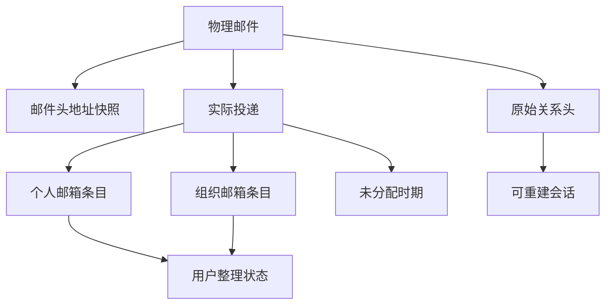

# 澄笺 | Simlettra 第二批数据模型确认清单

## 文档状态

- 状态：已接受
- 建立日期：2026-08-10
- 接受日期：2026-08-10
- 对应阶段：正式数据模型设计
- 依据：[需求基线](../需求/需求基线.md)、[数据模型设计总纲](数据模型设计总纲.md)和状态为“已接受”的架构决策记录
- 本批范围：物理邮件、实际投递、邮箱条目、个人整理状态、会话关系和未分配来信

## 怎样理解这一批

这一批不讨论数据库字段，而是先确定用户会直接感受到的邮件规则：

1. 同一封邮件发到多个地址时，邮箱里出现几条；
2. 个人邮箱和组织邮箱收到同一封邮件时，怎样避免权限和状态互相影响；
3. 新成员能否查看组织历史邮件，退出后再次加入会发生什么；
4. 垃圾箱到期和永久删除究竟删除谁的副本；
5. 回复怎样归入会话，未分配地址被认领时带走哪些历史邮件。

用户已于 2026-08-10 确认“第二批数据模型全部按推荐”。

## 已经确定的边界

以下内容已经由需求基线或已接受的架构决策确定，本批不重复选择：

1. D1 保存邮件元数据、权限关系和状态；KV 或 R2 保存原始 MIME、正文、附件和内嵌资源。
2. 搜索索引和搜索范围数据可以重建，不能作为判断邮件所有权或组织访问权的依据。
3. 必要正文和附件尚未完整写入并校验时，不创建可见邮箱条目；已可见邮件发现对象损坏时先撤销可见性，再进入修复。
4. 永久删除先撤销访问，再由可重试任务清理数据库、对象、搜索数据和缓存。
5. 组织成员的已读、星标、归档和垃圾箱状态彼此独立，普通成员不能永久删除组织原始邮件。

## 推荐方案

| 编号 | 需要决定的问题 | 推荐方案 | 用户能感受到的结果 | 状态 |
| --- | --- | --- | --- | --- |
| 数据-19 | “一封邮件”和“邮箱里的一条记录”是否是同一个对象 | 不是；物理邮件只保存一份内容，再按个人邮箱、组织邮箱或未分配地址建立不同的投递和邮箱关系 | 同一内容不会重复占用对象存储，但不同收件人仍能独立查看和整理 | 已确认 |
| 数据-20 | 怎样判断一次收信是安全重试还是一封新邮件 | 为收信操作保存独立防重键；重复使用同一防重键时继续原操作，不重新创建邮件。`Message-ID`、原始邮件哈希和时间只作为辅助证据，不能单独充当全局唯一编号 | 外部路由重试不会生成重复邮件，两个恰好使用相同 `Message-ID` 的真实来信也不会被误删 | 已确认 |
| 数据-21 | 邮件头中的收件人与系统实际投递地址是否合并保存 | 分开保存；邮件头保留发件人、收件人和抄送等原始信息，实际投递另外记录命中的系统地址及个人、组织或未分配归属 | 即使某个地址因密送或转发没有出现在邮件头中，用户仍能看到邮件实际送到了自己的哪个地址 | 已确认 |
| 数据-22 | 地址显示名称或系统地址以后发生变化时，旧邮件怎样显示 | 每封邮件保存当时的发件人、收件人、显示名称、地址角色和原始顺序快照，同时保存用于搜索和匹配的规范地址 | 以后修改显示名称、迁移主地址或删除账号，都不会改写历史邮件头 | 已确认 |
| 数据-23 | 密送收件人怎样避免互相泄露 | 发件人可以查看自己填写的全部密送对象；每名收件人只看到原邮件头允许显示的信息和邮件实际投递到自己的地址，不能从系统投递记录看到其他密送收件人 | 系统内直接投递不会意外暴露密送名单 | 已确认 |
| 数据-24 | 同一封邮件同时发到同一用户的主地址和多个个人别名时显示几条 | 在该用户的个人邮箱中只显示一条，并在详情中列出全部实际投递地址 | 用户不会看到多条内容完全相同的个人邮件，同时仍能知道哪些地址收到了它 | 已确认 |
| 数据-25 | 同一封邮件同时发到用户个人地址和其所在组织地址时是否合并 | 不合并；个人邮箱和每个组织邮箱分别建立一条有明确归属的邮箱条目 | 用户会看到清楚标注的个人副本和组织副本，个人删除或整理不会影响组织邮件 | 已确认 |
| 数据-26 | 组织邮件是否为每名成员复制一条完整邮箱记录 | 不复制；组织只保存一条共享邮箱条目，当前成员通过成员关系获得查看权，每名成员另存自己的整理状态 | 新增或退出成员不需要批量复制或删除组织邮件，成员之间的已读和星标仍互不影响 | 已确认 |
| 数据-27 | 新加入组织的成员能否查看加入前的历史邮件 | 可以查看组织仍保留的全部历史邮件；加入前的历史默认视为已读，加入后收到的新邮件默认未读 | 新成员能查阅上下文，但不会一加入就出现大量历史未读邮件 | 已确认 |
| 数据-28 | 成员退出后再次加入，原来的个人整理状态是否恢复 | 恢复仍存在邮件的已读、星标、归档、垃圾箱和单封远程图片设置；退出期间到达的邮件按加入前历史处理 | 暂时退出不会抹掉个人整理结果，再次加入也不会获得退出期间的实时成员权限痕迹 | 已确认 |
| 数据-29 | 是否为每封组织邮件预先给所有成员写一行默认状态 | 不预写；只在用户改变默认状态时保存个人状态。个人新来信和加入后组织新来信默认未读，已发送邮件及加入前组织历史默认已读；其他默认值为未星标、未归档、未进垃圾箱、阻止远程图片 | 大组织历史不会产生大量无意义记录，用户看到的默认行为仍然明确一致 | 已确认 |
| 数据-30 | “收件箱、已发送、草稿箱、垃圾邮件、垃圾箱、归档、全部邮件”怎样落到数据上 | 草稿使用独立草稿对象；已发送记录邮件来源方向；收件箱、垃圾邮件和垃圾箱保存当前放置状态；星标和归档保存个人标记。“全部邮件”聚合非草稿、非垃圾邮件、非垃圾箱的邮件，并包含归档和已发送 | 移动、归档和恢复不会复制正文；已发送邮件移入垃圾箱后会从已发送视图暂时消失，恢复后回到已发送 | 已确认 |
| 数据-31 | 组织邮件被某名成员移入垃圾箱并超过 30 天后怎么办 | 只从该成员的视图永久隐藏，不删除组织原始邮件；组织创建者自己的垃圾箱到期也只影响创建者个人视图。组织范围的永久删除必须使用单独的“从组织永久删除”操作并二次确认 | 某个成员清理自己的邮箱不会让其他成员丢信，创建者也不会因普通垃圾箱到期而误删全组织邮件 | 已确认 |
| 数据-32 | 一份邮箱副本被永久删除后，物理邮件内容是否立即删除 | 只删除对应个人或组织邮箱关系；只要其他个人邮箱、组织邮箱、可恢复记录或未完成任务仍引用该物理邮件，就保留内容。最后一个合法引用消失并满足保留规则后，才进入对象清理 | 同一封邮件发给多人时，一个人的永久删除不会影响其他人；没有任何合法引用后才真正释放空间 | 已确认 |
| 数据-33 | 邮件怎样自动归入同一会话 | 优先使用系统内明确的回复关系，其次使用标准 `In-Reply-To` 和 `References`；仅主题相同不能自动合并。缺少父邮件时先保留关系标识，父邮件以后出现时可以重新关联 | 标题相同的无关邮件不会被强行揉在一起，晚到或迁移补入的邮件仍有机会回到正确会话 | 已确认 |
| 数据-34 | 会话分组是否是不可修改的原始事实 | 不是；原始邮件关系头和系统内回复关系才是权威事实，会话编号是可重建结果，并且必须在个人或组织邮箱范围内展示 | 修复会话不会改写原始邮件，也不会因另一邮箱中存在相关邮件而泄露其存在 | 已确认 |
| 数据-35 | 同一未创建地址被认领、释放后再次收到来信，历史怎样划分 | 为每个规范地址建立一段“未分配时期”；认领时只接收当前时期的历史来信并关闭该时期。地址以后重新释放，再收到的邮件建立新的时期 | 后来的认领者不会看到该地址上一次被别人认领前后的旧邮件 | 已确认 |
| 数据-36 | 未分配来信怎样查看和认领 | 未分配来信放在独立视图，不自动混入个人收件箱；获授权用户可以查看和搜索，但在认领前不提供星标、归档、垃圾箱或永久删除。认领在一个事务中占用个人别名配额、创建别名、关闭未分配时期并为该时期来信建立个人邮箱条目；并发时只有第一名成功者生效 | 认领要么完整成功，要么完全不改变现状；一封邮件同时发到多个未分配地址时，各地址仍可独立认领 | 已确认 |
| 数据-37 | 放行远程图片和信任发件人的设置属于谁、信任范围多大 | 单封放行和可信发件人都属于当前用户；组织成员互不影响。可信发件人只按完整规范发件地址匹配，不自动信任整个域名 | 一名成员加载远程图片不会替其他成员放行，信任某个联系人也不会顺带信任同域名的所有地址 | 已确认 |

## 推荐的数据关系

## 推荐的关键事务边界

本批建议把以下操作设计成不可拆开的 D1 事务；对象存储仍按照已经接受的跨资源状态机协调：

1. 在必要邮件对象校验完成后，一次建立物理邮件、邮件头地址、实际投递、邮箱条目和最终可见状态。
2. 同一物理邮件命中同一用户多个个人地址时，一次建立一条个人邮箱条目和多条实际投递关系。
3. 认领未分配地址时，一次完成配额检查、地址占用、别名归属、未分配时期关闭和历史邮箱条目建立。
4. 永久删除个人或组织邮箱关系时，一次撤销访问并登记后续内容清理任务。
5. 修复会话分组时只更新派生关系，不修改原始邮件头和系统内明确回复关系。

## 本批不决定的内容

以下内容留给后续批次：

1. 草稿版本、自动保存冲突和草稿附件对象的具体结构。
2. 站内与站外收件人拆分、每名收件人的发信状态、供应商事件和重试表。
3. 原始 MIME、正文、HTML、附件与内嵌资源的对象键和对象登记字段。
4. 通知、转发、配额、备份、迁移、审计和完整删除任务的具体表结构。
5. 会话列表的界面折叠方式，以及是否允许用户手动拆分或合并会话；首发需求尚未要求手动调整。

## 确认记录

用户于 2026-08-10 确认：“第二批数据模型全部按推荐”。数据-19 至数据-37 均已确认。

对应长期决定和后续设计记录于：

1. [0016 分离物理邮件、投递、邮箱条目与用户状态](../架构决策记录/0016-分离物理邮件投递邮箱条目与用户状态.md)。
2. [0017 以权威邮件关系重建邮箱范围会话](../架构决策记录/0017-以权威邮件关系重建邮箱范围会话.md)。
3. [0018 以未分配地址时期隔离认领历史](../架构决策记录/0018-以未分配地址时期隔离认领历史.md)。
4. [第二批数据模型设计](第二批数据模型设计.md)。
5. [0002 邮件投递与邮箱视图迁移草案](迁移草案/0002-邮件投递与邮箱视图.sql)。
6. [第二批数据模型迁移草案验证结果](../验证/第二批数据模型迁移草案验证结果.md)。
