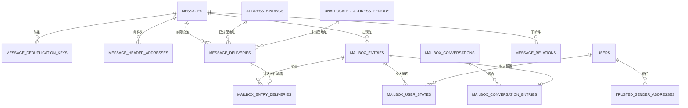

# 澄笺 | Simlettra 第二批数据模型设计

## 文档状态

- 状态：当前，已接受
- 建立日期：2026-08-10
- 接受日期：2026-08-10
- 对应确认：[第二批数据模型确认清单](第二批数据模型确认清单.md)
- 对应决策：[0016 分离物理邮件、投递、邮箱条目与用户状态](../架构决策记录/0016-分离物理邮件投递邮箱条目与用户状态.md)、[0017 以权威邮件关系重建邮箱范围会话](../架构决策记录/0017-以权威邮件关系重建邮箱范围会话.md)、[0018 以未分配地址时期隔离认领历史](../架构决策记录/0018-以未分配地址时期隔离认领历史.md)
- 迁移草案：[0002 邮件投递与邮箱视图](迁移草案/0002-邮件投递与邮箱视图.sql)
- 验证结果：[第二批数据模型迁移草案验证结果](../验证/第二批数据模型迁移草案验证结果.md)

## 设计范围

本设计把数据-19 至数据-37 转换成具体的 D1 表关系、唯一约束、权限查询边界和事务规则。它覆盖物理邮件、邮件头地址、实际投递、个人与组织邮箱条目、用户整理状态、会话事实、派生会话、未分配地址时期和可信发件人。

原始 MIME、正文、HTML、附件和内嵌资源的对象登记与收信状态机留给第四批；草稿和每名站外收件人的发送状态留给第三批。因此，本批迁移草案可以表达最终可见邮件关系，但不能单独完成生产收信或发信流程。

## 表与模块所有权

| 表 | 所属模块 | 保存内容 | 权威性 |
| --- | --- | --- | --- |
| `messages` | 收信、草稿与发信 | 一封物理邮件的稳定身份、主题、原始时间、排序时间、来源和内容摘要元数据 | 权威 |
| `message_deduplication_keys` | 收信 | 已完成物理邮件与防重键的唯一关联 | 权威；接收中的操作状态留给第四批 |
| `message_header_addresses` | 收信、草稿与发信 | 邮件头地址、显示名称、角色、顺序和密送可见范围快照 | 权威 |
| `unallocated_address_periods` | 收信 | 一个未创建规范地址的一段连续未分配时期及认领结果 | 权威 |
| `unallocated_access_grants` | 域名与地址 | 哪些用户可以查看指定域名的未分配来信 | 权威权限关系 |
| `message_deliveries` | 收信 | 一封物理邮件实际命中的地址归属或未分配时期 | 权威 |
| `mailbox_entries` | 邮箱 | 物理邮件在一个个人或组织邮箱上下文中的收件或已发送条目 | 权威访问关系 |
| `mailbox_entry_deliveries` | 邮箱 | 哪些实际投递共同形成一条收件邮箱条目 | 权威关系 |
| `mailbox_user_states` | 邮箱 | 当前用户对一条邮箱记录的非默认整理状态 | 权威个人状态 |
| `trusted_sender_addresses` | 邮箱 | 用户明确信任的完整规范发件地址 | 权威个人设置 |
| `message_relations` | 邮箱 | 系统内回复和标准关系头形成的权威关系事实 | 权威 |
| `mailbox_conversations` | 邮箱 | 某个个人或组织邮箱范围内的可重建会话 | 派生 |
| `mailbox_conversation_entries` | 邮箱 | 邮箱条目与派生会话的对应关系 | 派生 |

## 核心关系

## 物理邮件与邮件头

`messages` 不代表任何具体用户拥有邮件。它只保存一封物理邮件的公共事实：

1. `origin_type` 区分外部接收、系统内编写和旧系统迁移。
2. `internet_message_id` 可以为空或重复，不建立唯一约束。
3. `header_date_text` 保留原始 `Date` 头文字，`header_date_at` 保存成功解析后的 UTC 时间。
4. `accepted_at` 是 Simlettra 接受或生成邮件的时间，`sort_at` 是稳定列表排序时间。
5. `authored_by_user_id` 只用于系统内编写邮件，决定谁可以看到仅发件人可见的密送快照；组织其他成员不能因此取得密送名单。
6. `raw_size_bytes`、附件数量和是否有附件是用于列表、限制和对账的元数据，不代替第四批对象登记。

`message_header_addresses` 按角色和顺序保存每个已解析地址。`bcc` 只能使用 `sender_only` 可见范围，其他标准地址使用 `header`。地址快照插入后不可原地更新；重新解析必须在邮件不可见时删除并按新结果重建。

## 防重边界

`message_deduplication_keys` 保存来源类型和 32 字节防重摘要的唯一组合，并关联最终物理邮件。它证明某个已经完成的接收键对应哪封邮件，但不负责记录“原始对象已经写入、正在解析或等待 KV 一致性”等中间状态。

第四批需要在此基础上增加接收操作状态机。到时，操作先占用防重键，最终提交再关联 `messages`；不能用本表的存在替代完整接收状态。

## 实际投递与邮箱条目

已创建地址的 `message_deliveries` 引用当时的 `address_bindings`，未创建地址则引用 `unallocated_address_periods`。投递快照同时保存实际命中的规范地址和显示地址，地址以后释放或重新使用不会改写历史。

`mailbox_entries` 使用以下规则：

1. 每封物理邮件、每个用户、每种条目方向最多一条个人邮箱条目。
2. 每封物理邮件、每个组织、每种条目方向最多一条组织邮箱条目。
3. 同一用户多个个人地址的投递通过 `mailbox_entry_deliveries` 汇入同一条收件记录。
4. 个人和组织是不同上下文；同一物理邮件可以同时具有多个邮箱条目。
5. `received` 条目的初始位置是 `inbox` 或 `spam`，`sent` 条目的初始位置只能是 `sent`。
6. 发送者的已发送条目可以在没有本地实际投递时存在；站外收件人和投递结果在第三批建模。

实际投递只能关联一个收件邮箱条目。发件人的已发送条目通过物理邮件和后续发信收件人表展示目标，不重复占用实际收件投递关系。

## 用户状态与默认值

`mailbox_user_states` 以“邮箱条目加用户”为主键，字段使用可空覆盖值。没有状态行或字段为空时按以下规则计算：

| 状态 | 默认值 |
| --- | --- |
| 个人收件 | 未读 |
| 个人已发送 | 已读 |
| 组织邮件发生时间早于当前成员关系加入时间 | 已读 |
| 组织邮件发生时间不早于当前成员关系加入时间 | 收件未读、已发送已读 |
| 星标 | 否 |
| 归档 | 否 |
| 当前位置 | 邮箱条目的初始位置 |
| 单封远程图片 | 阻止 |

成员退出不删除状态行。重新加入后，已有状态覆盖默认值；退出期间到达且没有个人状态的邮件早于新成员关系的加入时间，因此默认已读。

`location_override` 只允许 `inbox`、`sent`、`spam`、`trash` 和 `hidden`。进入垃圾箱时同时保存原位置、进入时间和到期时间；到期后改为 `hidden`。恢复时清空垃圾箱时间并回到原位置。应用服务需要删除全为空的状态行，保持稀疏存储。

## 邮箱视图

1. 收件箱：收件条目，当前位置为 `inbox`，且未归档。
2. 已发送：已发送条目，当前位置为 `sent`。
3. 草稿箱：第三批独立草稿对象，不查询 `mailbox_entries`。
4. 垃圾邮件：当前位置为 `spam`。
5. 垃圾箱：当前位置为 `trash`。
6. 星标：当前用户标记为星标且未进入垃圾邮件、垃圾箱或永久隐藏的条目。
7. 归档：收件条目、当前位置为 `inbox` 且已归档。
8. 全部邮件：非草稿、非垃圾邮件、非垃圾箱、非永久隐藏的个人与可访问组织条目，包含归档和已发送。

组织创建者普通移动、归档或垃圾箱操作仍然只写自己的 `mailbox_user_states`。组织范围永久删除必须删除或撤销组织 `mailbox_entries`，并登记后续生命周期清理任务，不能通过创建者状态行隐式触发。

## 权限查询边界

个人邮箱条目的访问条件为：条目 `user_id` 等于当前活动用户。组织邮箱条目的访问条件为：当前用户状态允许使用，且存在该组织未退出的成员关系。查询不能因为存在 `mailbox_user_states`、派生会话或搜索范围行而跳过这些条件。

密送地址的读取还需要额外满足 `messages.authored_by_user_id` 等于当前用户。组织成员只能因为组织条目查看普通邮件头，不能查看另一名成员编写的密送名单。

可信发件人按完整规范地址查询。`alice@example.com` 的信任记录不匹配 `billing@example.com`，即使两者属于同一域名。

## 会话关系

`message_relations` 保存每封子邮件的关系类型、顺序、目标引用文字和可选的已解析父邮件编号：

1. `internal_reply` 表示 Simlettra 明确知道的回复父邮件。
2. `in_reply_to` 表示标准 `In-Reply-To`。
3. `reference` 按原始 `References` 顺序保存。

目标物理邮件被清理时，已解析编号可以变为空，但目标引用文字继续保留。会话重建先使用 `internal_reply`，再使用 `in_reply_to` 和 `reference`。主题只用于显示和搜索，不建立关系。

`mailbox_conversations` 和 `mailbox_conversation_entries` 都是派生表。会话范围必须明确指向一个用户或一个组织；每条邮箱条目在当前派生结果中最多属于一个会话。重建时可以整批删除并重新生成。

## 未分配地址时期与认领

`unallocated_address_periods` 为完整规范地址保存开放、已认领或已关闭状态。同一规范地址同时最多有一个开放时期，且比较不区分大小写。时期的地址文字和开始时间不可原地修改。

`unallocated_access_grants` 按域名授权用户查看未分配来信。授权关系本身不授予地址所有权，也不产生个人邮箱条目。

认领事务按以下顺序检查并写入：

1. 用户、域名和开放时期仍有效，用户具有查看授权、自建别名权限和剩余配额。
2. 为规范地址创建新的地址身份、当前占用和个人别名归属。
3. 把开放时期更新为已认领，记录认领者、新地址身份和关闭时间。
4. 按该时期的物理邮件和认领用户建立个人收件邮箱条目；同一物理邮件只建立一条。
5. 把该时期的全部实际投递关联到对应个人邮箱条目。
6. 数量和约束全部满足后提交；任一步失败则整体回滚。

一封物理邮件可以关联多个未分配时期。认领其中一个地址不会关闭或移动其他地址的时期和投递。

## 删除与对象清理

1. 删除个人邮箱副本只删除或撤销该用户的 `mailbox_entries`，其个人状态和派生会话关系随之清理。
2. 组织范围永久删除只删除或撤销该组织的 `mailbox_entries`，所有成员状态和该组织派生会话随之失效。
3. `message_deliveries` 是投递事实，不因某名用户整理或隐藏而修改。
4. 物理邮件是否可以清理，必须综合邮箱条目、未分配时期、恢复期限、导出、迁移和后台任务引用；完整判定留给第六批。
5. 当前迁移草案使用外键阻止仍被关系引用的物理邮件被直接删除，生产清理必须按后续状态机规定顺序执行。

## 关键唯一约束

1. 同一来源类型和防重摘要只关联一封物理邮件。
2. 同一邮件头角色和顺序只能有一个地址快照。
3. 同一规范地址同时只能有一个开放未分配时期。
4. 同一物理邮件对同一地址归属或同一未分配时期只有一条实际投递。
5. 同一物理邮件、个人邮箱和条目方向只有一条邮箱条目；组织邮箱规则相同。
6. 一条实际收件投递最多汇入一条收件邮箱条目。
7. 同一用户对同一邮箱条目最多一行个人状态。
8. 同一用户只能有一条相同完整规范地址的可信发件人设置。
9. 同一子邮件、关系类型和顺序只有一条权威关系。
10. 每条邮箱条目在派生会话中最多出现一次。

## 仍未确认或留待后续的事项

1. 垃圾邮件由外部服务、管理员规则还是用户操作进入的详细优先级。
2. 大量历史未分配邮件认领时，单次 D1 事务的实际语句上限与分批预计算方式。
3. 关闭但未认领时期的默认保留时间。
4. 会话列表是否提供手动拆分或合并；首发需求目前没有要求。
5. 对象登记、修复状态、删除任务和搜索 FTS5 的正式表结构。

这些内容不能从迁移草案的预留字段反推为已确认产品行为。

## 验证要求

1. 从第一批迁移草案开始顺序执行两份 SQL，外键检查为零。
2. 验证防重、邮件头顺序、密送范围、开放时期、个人与组织邮箱条目的唯一约束。
3. 验证同一用户多地址投递可以汇入一条个人邮箱记录，个人和组织副本保持分离。
4. 验证组织退出立即失去访问，重新加入恢复个人状态，历史默认已读。
5. 验证垃圾箱时间、永久隐藏和恢复位置的状态约束。
6. 验证删除一条邮箱副本不会删除仍被其他邮箱引用的物理邮件。
7. 验证相同主题不建立关系、父邮件晚到可以补充解析、派生会话不授予权限。
8. 验证未分配地址认领成功与失败回滚，以及地址释放后的新时期隔离。

本地结构与行为验证已于 2026-08-10 完成：两批迁移草案顺序建立 26 张表，第二批新增 13 张；48 个约束、权限、认领、跨表匹配和删除场景全部通过，外键检查为零。真实 D1、Drizzle 对齐、应用服务授权和目标规模性能仍需继续验证。
