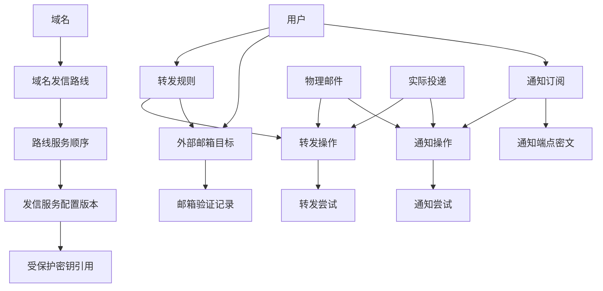

# 澄笺 | Simlettra 第五批数据模型确认清单

## 文档状态

- 状态：当前，已接受
- 建立日期：2026-08-10
- 接受日期：2026-08-11
- 对应阶段：正式数据模型设计
- 依据：[需求基线](../需求/需求基线.md)、[数据模型设计总纲](数据模型设计总纲.md)、[候选目标架构](../架构/候选目标架构.md)和状态为“已接受”的架构决策记录
- 已有关联决定：[0002 以 D1 保存权威状态并以对象存储保存邮件内容](../架构决策记录/0002-以D1保存权威状态并以对象存储保存邮件内容.md)、[0003 使用 Cloudflare Queues 唤醒异步任务](../架构决策记录/0003-使用CloudflareQueues唤醒异步任务.md)、[0010 采用供应商感知的域外发信状态机](../架构决策记录/0010-采用供应商感知的域外发信状态机.md)、[0021 以供应商尝试和不可变事件维护域外发信状态](../架构决策记录/0021-以供应商尝试和不可变事件维护域外发信状态.md)
- 本批决策：[0025 采用受保护主密钥加密 D1 服务凭据](../架构决策记录/0025-采用受保护主密钥加密D1服务凭据.md)、[0026 采用域名级优先发信路线与安全故障切换](../架构决策记录/0026-采用域名级优先发信路线与安全故障切换.md)、[0027 以独立操作协调通知、外部邮箱验证与来信转发](../架构决策记录/0027-以独立操作协调通知外部邮箱验证与来信转发.md)、[0028 首发域外发信只支持 Resend 和 SMTP2GO](../架构决策记录/0028-首发域外发信只支持Resend和SMTP2GO.md)
- 本批范围：通知通道、通知订阅、外部邮箱验证、来信转发规则、站外发信网关配置引用，以及通知与转发的执行结果

> 后续变更：用户于 2026-08-11 明确首发移除 Cloudflare Email Sending。需求变更 `0004` 与 ADR `0028` 已取代本批原有三家 Provider 范围；当前只允许 Resend 和 SMTP2GO，其他数据模型结论继续有效。

## 怎样理解这一批

这一批决定的是：系统怎样记住“要把哪封邮件通知给谁、要把哪封来信转发到哪里、使用哪个外部发信服务”，并且在通知或转发失败时，既不丢失原邮件，也不泄露服务凭据。

它不会决定设置页面长什么样，也不会改变已确认的邮件收发规则。重点是让以下事情可靠成立：

1. 用户可以使用 ntfy、Gotify、WxPusher、Telegram 或 Bark 接收通知；
2. 用户只能向自己已经验证的外部邮箱自动转发；
3. 每个域名可以按优先顺序配置 Resend 和 SMTP2GO；默认服务无法安全发信时，系统可以切换到备用服务；
4. 外部服务临时失败时可安全重试，失败结果可见，但原邮件仍留在 Simlettra；
5. 密钥、访问令牌、通知正文和转发内容不会被复制进普通日志或配置记录。

用户于 2026-08-11 确认本批全部内容。下表保留当时的确认问题、最终结论和状态，供后续实现与变更追踪使用。

## 已经确定的边界

以下内容已由需求基线或已接受的架构决定，本批不重新选择：

1. 外部通知默认包含发件人、收件人、主题和完整正文，不发送附件；浏览器新邮件通知不进入首发。
2. 用户可以把来信转发到经过验证的外部邮箱，默认关闭；规则可以覆盖全部来信或指定收件地址。
3. 通知或转发失败不能影响原邮件接收，用户或管理员必须能看到失败状态。
4. 站外发信服务按域名配置，首发只支持 Resend 和 SMTP2GO；服务密钥不向普通用户公开。
5. 一次站外发信的网关类型、配置版本和有效大小规则会在发送操作接受时冻结；逐收件人状态、供应商尝试和回调事件已由第三批确定。
6. D1 保存权威状态和最小元数据，KV 或 R2 保存邮件内容对象；Queue 只唤醒任务，D1 任务状态才是事实来源。

## 推荐方案

| 编号 | 需要决定的问题 | 推荐方案 | 用户能感受到的结果 | 状态 |
| --- | --- | --- | --- | --- |
| 数据-80 | 外部连接设置按什么层次保存 | 分成三层：系统或域名可用的“服务配置”、用户自己的“通知订阅或转发目标”、每次实际执行的“通知或转发尝试”。三层通过稳定内部编号关联，不把整套设置塞进用户资料或一封邮件记录中 | 改一个通知端点不会改到其他人的设置；修改某个域名的发信服务也不会改写已经发送邮件的历史 | 已确认 |
| 数据-81 | 一个域名怎样配置默认和备用发信服务 | 每份服务配置保存供应商类型、非敏感连接选项、启用状态、版本号、创建与停用时间；同一配置可以被一个或多个域名使用。每个域名有一条“发信路线”，其中按顺序包含一个默认服务和零个或多个备用服务；默认服务不能安全完成发送时，系统按顺序尝试下一个可用服务 | 管理员可为同一个域名预先配置多家服务。某家服务暂时不可用时，邮件可自动改由备用服务发送，而不必先改全局设置 | 已确认 |
| 数据-82 | 发信服务的密钥怎样保护 | 唯一系统管理员在 Cloudflare Worker 运行时配置中保存并可查看独立于 `init_key` 的 `CONFIG_KEY`。管理员在网页中录入 Resend 或 SMTP2GO 的 API 密钥和回调凭据后，Worker 使用该主密钥加密，再把密文、随机值和密钥版本保存到 D1；管理员可在网页中查看、复制、替换、删除和测试明文，普通用户不能访问。D1 加密用于避免数据库副本直接暴露可用凭据，不用于防范管理员 | 管理员可以在一个网页里完整维护多家服务；同时 D1 备份不会直接成为明文服务密钥集合 | 已确认 |
| 数据-83 | 管理员修改发信路线后，正在处理的邮件怎么办 | 域名当前指向一条有顺序的发信路线；接受发送时冻结整条路线中各服务的编号、版本、顺序和有效大小规则。普通修改只影响后续发送；停用当前服务时，尚未提交的收件人只可依照已冻结路线切换到下一个合格服务，不能临时选用后来新增的服务 | 管理员调整默认或备用服务后，已经点击发送的邮件仍遵循当时看到的路线；发送过程不会因为设置变化而悄悄改走一条从未确认的服务 | 已确认 |
| 数据-84 | 通知订阅属于谁，能通知哪些邮件 | 每个通知订阅属于一个用户，可独立启用、暂停或删除，并可选择个人地址和当前有查看权的组织地址作为来源范围。任务真正执行前再次检查用户、地址和组织成员资格；退出组织后，旧订阅不再接收该组织的新邮件 | 每个人可以按自己的设备设置提醒；退出组织后不会继续收到组织来信通知 | 已确认 |
| 数据-85 | 用户自己的通知端点凭据怎样保存 | 使用与数据-82 相同的配置加密主密钥，加密 Gotify 应用令牌、Bark 设备密钥或 ntfy 认证令牌后再保存到 D1；D1 额外保存通道类型、非敏感路由信息和密钥版本。任务运行时短暂解密，日志不记录明文 | 用户不必请管理员为每台手机手工新增部署变量，同时其通知令牌不会以明文留在数据库 | 已确认 |
| 数据-86 | 通知内容怎样生成，是否另存一份正文 | 通知任务只引用已完整保存的物理邮件、实际投递和订阅编号；执行时从已授权邮件对象生成发件人、收件人、主题和完整正文，不发送附件，也不在 D1、任务消息或普通日志中再复制正文。保存通知内容版本、字节数、结果摘要和必要的内容哈希，便于对账而不重复存敏感内容 | 通知默认内容符合需求；通知服务失败后，系统仍能说明针对的是哪封邮件，而不会多留一份正文副本 | 已确认 |
| 数据-87 | 通知失败、重复任务和供应商限制怎样处理 | 每个“邮件投递加通知订阅”最多有一个权威通知操作，操作下可有多次尝试。明确未提交的临时失败可按任务规则重试；已经可能提交但未得到响应时标为结果未知，不盲目重复推送。通知正文超过通道限制时记录明确失败，不静默截断“完整正文” | 网络短暂问题会自行恢复；可能已经推送成功时不会反复打扰用户；内容太大时能看见原因 | 已确认 |
| 数据-88 | 外部转发邮箱怎样证明属于设置者 | 外部邮箱目标按“用户加规范邮箱地址”保存，并有待验证、已验证、已过期、已停用和已删除等明确状态；同一用户不能同时创建重复目标。转发规则只能引用当前已验证目标 | 用户填错邮箱或别人代填的邮箱，不能立刻开始接收自动转发 | 已确认 |
| 数据-89 | 外部邮箱验证凭据怎样保存和使用 | 创建目标后，系统使用已配置的站外发信服务向该地址发送一次性高熵验证代码。D1 只保存代码哈希、有效期、失败次数、发送与完成时间；用户在登录后的设置页面输入代码完成验证。代码不放在网址、日志或审计详情中，过期或多次失败后必须重新发起 | 转发目标必须由实际收到验证邮件的人确认；误转发风险更低，也不会把验证凭据留在浏览器历史或日志中 | 已确认 |
| 数据-90 | 转发规则能覆盖哪些来信 | 一条规则属于一个用户，默认关闭；范围只能是“该用户全部个人来信”或“该用户指定的主地址、个人别名”。首发不允许普通成员把组织共享地址的邮件自动转发到外部邮箱；若以后需要组织转发，应由新需求定义组织创建者授权和成员可见性规则 | 用户能转发自己的个人邮件，又不会因为某个组织成员自行设置规则而把共享邮箱持续转到外部 | 已确认 |
| 数据-91 | 转发时怎样保留准确内容并避免受后续修改影响 | 每次匹配规则后创建独立转发操作，引用原物理邮件、实际投递、规则和验证目标，并冻结目标地址、规则版本和待提交内容摘要。转发内容由已验证的原始 MIME 或已完整保存的结构化内容生成；不使用可被草稿、地址显示名称或规则修改影响的临时数据 | 邮件在转发队列等待时，即使用户后来改了规则或删除了别名，也不会把同一次转发发到错误地址或变成另一封内容 | 已确认 |
| 数据-92 | 转发怎样防止重复和转发环路 | 转发操作以“原邮件、实际投递、规则版本和目标地址”建立唯一防重关系；同一规则重复匹配或任务重复消费只产生一次逻辑转发。出站邮件写入稳定的 Simlettra 转发标记，并拒绝再次转发带有本系统标记、超过有限跳数或目标属于本系统管理域名的邮件 | Queue 重复、来信回环或把外部目标设成自家地址时，不会不断生成邮件和消耗配额 | 已确认 |
| 数据-93 | 转发失败如何与普通用户发信区分 | 转发使用独立的转发操作、尝试和状态记录，不伪装成用户手写的“已发送邮件”，也不占用用户每日发件额度。它可以复用已确认的域外发信适配器和安全重试边界，但在界面上单独显示“已转发、失败、结果未知”等结果 | 用户不会在已发送里看到自己没有写过的邮件；转发故障可追踪，也不会影响手写邮件的额度 | 已确认 |
| 数据-94 | 权限变化或原邮件删除后，尚未执行的通知和转发怎么办 | 每次尝试前重新检查来源邮件是否仍完整、用户是否正常、订阅或规则是否启用、目标是否仍已验证，以及当前是否有查看或转发权。任一条件失效即取消尚未提交的外部操作并记录原因；已经提交给外部服务的内容无法撤回，但不再继续重试 | 用户禁用、退出组织、关闭规则或删除目标后，尚未发出的外部操作会及时停止 | 已确认 |
| 数据-95 | 管理员和用户能看到哪些外部连接状态 | 用户只可查看和管理自己的通知订阅、验证目标、转发规则及其结果。管理员可查看域名网关是否可用、配置版本、最近健康检查和全局失败汇总，但默认不读取个人通知正文、转发正文、个人端点明文或外部邮箱验证码。每次创建、验证、启停、删除和失败处理记录最小审计事件 | 排错时能知道哪里坏了，同时不会把邮件内容和凭据暴露到管理界面或日志 | 已确认 |
| 数据-96 | 默认服务“发信失败”时，什么时候允许自动切换 | 只有适配器能明确证明当前服务**尚未接受**该收件人，且失败属于服务不可用、服务限制不兼容、服务端临时拒绝或该配置被停用时，才按冻结路线切到下一家。地址格式错误、全局大小超限、发件权限失效等本地确定性错误直接失败；请求已发出但响应丢失、连接中断等结果未知时绝不自动切换 | 默认服务真正不可用时可自动换备用服务；网络异常导致是否已发出无法确定时，系统宁可提示“结果未知”，也不会让同一人收到两封邮件 | 已确认 |
| 数据-97 | 有默认和备用服务后，单封邮件大小怎样判断 | 接受发送前，对每名站外收件人检查冻结路线中是否至少有一家服务能接受最终完整邮件字节和该收件条件；只有每名收件人都存在至少一个合格服务时，整次发送才开始。实际提交时优先选择路线中靠前且合格的服务，不再把备用服务中最小的上限强行当作整封邮件上限 | 例如默认服务当前有效上限低于邮件大小、备用服务仍可接受时，邮件可直接使用兼容的备用服务；如果 Resend 和 SMTP2GO 都不支持，发送前明确提示失败 | 已确认 |
| 数据-98 | 多收件人使用不同备用服务时，怎样显示和追踪 | 每名站外收件人独立保存已选择的服务、每次尝试、切换原因和最终状态；整封邮件仍是一封已发送邮件，汇总状态从各收件人计算。管理员只能查看服务层面的失败摘要，用户可在自己的邮件详情中看到每个收件人的投递进度 | 一封邮件可让能用默认服务的收件人正常发送、让受大小或服务故障影响的收件人自动走备用服务，结果不会互相覆盖 | 已确认 |

## 推荐的数据关系

## 推荐的关键事务与执行边界

1. 系统管理员创建、查看、复制、替换、删除或测试发信服务密钥时，Worker 在完成管理员身份检查后才使用受保护部署配置中的配置加密主密钥解密或加密；D1、审计和日志都不保存明文。启用或停用服务配置和域名发信路线时，每条启用路线至少包含一家服务，顺序变化只影响后续发送。
2. 用户创建或修改通知订阅时，敏感端点值先加密，再与订阅元数据一起写入；任务和日志只收到稳定编号。
3. 外部邮箱验证时，创建验证码哈希和待验证状态后才投递验证邮件；完成验证使用一次性条件更新，重复输入不能重复生效。
4. 一封邮件进入可见状态后，才为匹配的通知订阅和转发规则创建独立操作及后台任务；任何外部操作失败都不能回滚邮件接收。
5. 每次通知或转发提交前，先登记尝试并检查当前授权与冻结快照；域外发信或转发仅在能够证明前一家服务未接受时切换备用服务。网络调用后的结果只按允许状态迁移回写。
6. 禁用、删除、退出组织、验证过期或永久删除时，先撤销后续外发资格，再由可重试任务清理密文、尝试记录和不再需要的对象。

## 本批不决定的内容

1. 通知设置、转发设置、验证码输入和失败提示的具体页面文案与布局。
2. 每一种通知服务的实际请求格式、速率限制、最大正文大小和错误码映射；实现前仍需基于当时官方资料建立适配器契约测试。
3. 通知失败后具体重试次数、退避时间和“结果未知”的提醒等待时间，以及每个域名允许配置的备用服务数量；它们复用后台任务框架，并在实现阶段按服务能力细化。
4. 组织共享地址的自动转发授权机制；本批推荐首发不开放，未来如需支持必须先新增需求。
5. 删除后各类执行记录、验证码和端点密文的具体保留期限，以及配额、备份、恢复、迁移和审计表的完整结构；这些留给第六批数据模型。
6. 真实服务密钥、配置加密主密钥、用户端点和外部邮箱地址；它们不应写入项目文档、测试样例或仓库。

## 确认记录

用户于 2026-08-11 确认第五批数据模型全部内容。数据-80 至数据-98 均为“已确认”。

本批由 ADR `0025` 至 `0028`、[第五批数据模型设计](第五批数据模型设计.md)、`0005` 迁移草案和验证结果承接。关于单供应商快照、“每份服务密钥只保存部署配置引用”和三家 Provider 范围的旧结论，通过后续 ADR 保留历史并明确取代；个人邮件的管理员读取和删除边界、日志最小化、密码哈希、会话令牌保护等其他结论保持不变。
