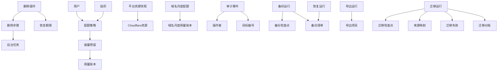

# 澄笺 | Simlettra 第六批数据模型确认清单

## 文档状态

- 状态：当前，全部已接受
- 建立日期：2026-08-11
- 原清单接受日期：2026-08-11
- 补充清单接受日期：2026-08-11
- 对应阶段：正式数据模型设计
- 依据：[需求基线](../需求/需求基线.md)、[数据模型设计总纲](数据模型设计总纲.md)、[候选目标架构](../架构/候选目标架构.md)和状态为“已接受”的架构决策记录
- 已有关联决定：[0002 以 D1 保存权威状态并以对象存储保存邮件内容](../架构决策记录/0002-以D1保存权威状态并以对象存储保存邮件内容.md)、[0009 采用可对账状态机协调 D1 与对象存储](../架构决策记录/0009-采用可对账状态机协调D1与对象存储.md)、[0013 采用权威数据逻辑备份并重建搜索索引](../架构决策记录/0013-采用权威数据逻辑备份并重建搜索索引.md)、[0024 以 D1 任务租约和分批对账协调后台工作](../架构决策记录/0024-以D1任务租约和分批对账协调后台工作.md)
- 本批范围：删除与恢复期限、存储与发件配额、审计和历史保留、本地备份、完整恢复、用户导出与旧系统迁移

## 怎样理解这一批

这一批决定的是：当数据不再使用、容量接近上限、系统需要备份恢复，或者从旧系统搬迁时，Simlettra 怎样留下足够的进度和对账证据，同时不误删、重复导入或悄悄丢失邮件。

它不会决定按钮放在哪里，也不会开始实现备份工具。重点是先让以下事情有清楚规则：

1. “禁用”“放入垃圾箱”“等待删除”和“永久删除”是不同状态；
2. 邮件被多个用户或组织共享时，只删除有权删除的那一份；
3. 配额按用户真正理解的邮箱容量计算，不把搜索索引等内部重复数据算进去；
4. 本地备份可以断点继续、加密保存并经过完整恢复验证；
5. 旧系统迁移可以重复执行，失败后继续，不会导入重复用户或邮件。

## 已经确定的边界

以下内容已由需求基线或已接受的架构决定，本批不重新选择：

1. 用户注销和组织删除默认有七天恢复期；垃圾箱邮件默认保留 30 天；个人别名保留期为 0 至 30 天，默认立即释放。
2. 管理员不能代替用户永久删除单封个人邮件；普通成员不能永久删除组织原始邮件，只有组织创建者可以。
3. 永久删除必须同时清理数据库、正文、附件、搜索数据和缓存；跨 D1 与 KV/R2 的清理使用可重试后台任务和对账。
4. 管理员可以设置用户和组织存储配额，并可以限制用户每日发件数量。
5. 审计记录登录、改密、权限、域名、组织、删除和重要设置变化，不记录邮件正文和密钥。
6. 完整本地备份包含权威 D1 数据与当前 KV/R2 对象，排除可重建搜索索引；备份和恢复工具与正常 Worker 请求路径分离。
7. 迁移程序只读旧系统、可重复执行，并在正式迁移前使用数据副本演练。

## 模块一：删除、恢复与永久清理

| 编号 | 需要决定的问题 | 推荐方案 | 用户能感受到的结果 | 状态 |
| --- | --- | --- | --- | --- |
| 数据-99 | 各类删除是否使用同一种记录 | 每次高风险删除都建立独立“删除操作”，保存申请人、目标、当时的规则、影响数量、恢复截止时间、当前步骤和有限错误；禁用仍是原对象状态，不伪装成删除 | 管理员和用户能分清“只是停用”“还能恢复”和“已经永久清理” | 已确认 |
| 数据-100 | 用户申请注销后怎样保存七天冷静期 | 用户进入待注销后立即撤销普通会话、停止登录和收发，只允许进入恢复流程；保存申请时间、截止时间和取消结果。组织创建者必须先转让或删除组织，唯一系统管理员必须先转让管理员身份 | 七天内可以明确取消注销；依赖未处理完时系统会提前阻止，而不是到期后卡住 | 已确认 |
| 数据-101 | 用户永久删除后是否完全删除用户行 | 清理密码、会话、个人设置、个人邮箱、草稿、通知、转发和可识别资料；仅保留不含显示名称和邮箱地址的最小“已删除用户”占位编号，用于维持他人邮件、组织历史和审计引用 | 账号本身不可恢复，其他人的合法历史记录不会因外键断裂而损坏 | 已确认 |
| 数据-102 | 个人别名删除与地址释放怎样衔接 | 先结束地址归属并停收停发，再按管理员当时设置的 0 至 30 天保留期冻结地址文字；期限结束只释放“地址占用”，历史邮件仍引用原地址身份，不把旧身份改给新用户 | 默认可立即重新使用别名；设置保留期时，别人不能在期限内抢注同一地址 | 已确认 |
| 数据-103 | 垃圾箱和永久删除怎样处理共享邮件 | 个人或组织成员移入垃圾箱只改变自己的邮箱状态，默认 30 天后清理自己的邮箱条目；物理邮件仍被其他个人、组织、未分配时期或任务引用时不得删除。组织创建者执行“为组织永久删除”时才撤销整个组织邮箱条目 | 删除自己的邮件不会误删别人仍在查看的同一封邮件；组织成员的垃圾箱互不影响 | 已确认 |
| 数据-104 | 组织删除七天恢复期怎样保存 | 创建者确认删除后，组织、成员访问和组织地址立即停用，地址保持占用；七天内只有创建者可恢复。到期后建立永久清理任务，清除组织邮箱和设置，再释放地址 | 删除后不会继续收发；七天内可以完整恢复组织、成员和邮件访问 | 已确认 |
| 数据-105 | 域名或地址仍被引用时怎样阻止误删 | 删除前生成影响清单，列出仍有关联的地址、邮件、发信路线、转发、任务和备份要求；只要存在必须迁移或清理的阻塞项，就不能进入永久删除 | 管理员会看到具体还差什么，不会只得到模糊的“删除失败” | 已确认 |
| 数据-106 | 跨 D1、KV/R2、搜索和缓存的永久清理顺序 | 先撤销产品内访问，再冻结一份删除计划，按数据库关系、对象、搜索和缓存分步骤执行；每一步幂等、可重试并记录结果。只有所有必要步骤和对象对账通过后才标记永久完成 | 故障中断后可以继续清理，不会出现邮件已看不见但附件永远遗留，或附件先删导致其他邮箱损坏 | 已确认 |
| 数据-107 | 在线永久删除能否同时删除过去的本地备份 | 不能。系统只能清理当前 Cloudflare 资源和由系统管理的临时导出，无法修改管理员已经保存到本地的旧备份。恢复旧备份前必须显示备份日期和可能恢复已删除数据的警告，并要求再次确认 | “永久删除”对当前系统立即生效，但管理员仍需自行保管或销毁历史本地备份 | 已确认 |

## 模块二：存储配额与每日发件额度

| 编号 | 需要决定的问题 | 推荐方案 | 用户能感受到的结果 | 状态 |
| --- | --- | --- | --- | --- |
| 数据-108 | 存储配额按什么层级设置 | 保存一份系统默认用户配额、一份系统默认组织配额，并允许管理员为单个用户或组织设置覆盖值；每次接受会增加存储的操作时冻结当时生效的配额版本。默认值为 KV 模式用户/组织各 100,000,000 字节，R2 模式用户/组织各 1,000,000,000 字节 | 家庭成员可用同一默认值，也能单独给某个用户或组织更多空间 | 已确认，默认值由需求变更-0009补充 |
| 数据-109 | 用户和组织的容量怎样计算 | 个人主地址和全部个人别名合并为一个用户邮箱容量；同一物理邮件无论投递到该用户几个地址只计一次。组织邮件按组织计一次，不按成员人数重复计算；草稿及草稿附件计入创建者 | 容量数字与“我的邮箱”和“组织邮箱”直觉一致，不会因多个别名或成员人数无故翻倍 | 已确认 |
| 数据-110 | 垃圾箱、搜索和内部重复对象是否计入配额 | 垃圾箱在永久删除前继续计入；邮件按对用户可理解的逻辑邮件大小计费，不把解析正文、搜索索引、缓存、通知或转发记录等内部派生数据重复计入。管理员另行查看系统实际物理存储量 | 用户删除垃圾箱后空间才真正释放；不会因为系统内部保存多种正文形式而被重复扣容量 | 已确认 |
| 数据-111 | 怎样避免并发收信或上传同时越过配额 | 在接收邮件、保存草稿附件或接受发信前建立短期容量预留；成功后转为正式用量，失败或超时自动释放。用量账本可从权威邮件和草稿关系重新计算并对账 | 两台设备同时上传或多封邮件同时到达时，显示的额度不会长期算错 | 已确认 |
| 数据-112 | 超过存储配额时怎样处理新邮件和现有数据 | 不删除现有邮件，也不阻止阅读、导出和永久删除；只拒绝会继续增加该邮箱容量的新投递、草稿附件和已发送副本，并记录明确的“容量不足”结果。同一封邮件投递到多个本地邮箱时，各目标独立判断，未超额目标仍可接收 | 邮箱满了不会丢掉已有内容；清理空间后可恢复正常使用，其他收件人不被连带阻断 | 已确认 |
| 数据-113 | 每日发件数量怎样计算和重置 | 使用滚动 24 小时窗口，按第三批已经记录的去重后最终收件人数计量；管理员设置系统默认值并可逐用户覆盖。站内和站外普通发信都计入，通知、验证邮件和自动转发不占用户额度 | 不会因修改时区或跨过午夜突然获得双倍额度；用户可以看到剩余额度和最早恢复时间 | 已确认 |

## 模块三：审计与运行历史

| 编号 | 需要决定的问题 | 推荐方案 | 用户能感受到的结果 | 状态 |
| --- | --- | --- | --- | --- |
| 数据-114 | 审计记录保存哪些内容 | 每条事件保存时间、操作者类型与编号、动作、目标类型与编号、成功或失败、有限原因、请求追踪编号；登录安全事件可保存来源 IP 和简化后的浏览器信息。禁止保存正文、附件内容、密码、会话令牌、验证码和密钥 | 管理员能判断谁在什么时候改了重要设置，同时审计本身不会变成邮件和密钥副本 | 已确认 |
| 数据-115 | 审计记录能否被单独修改或删除 | 审计事件一旦写入就不能改写。作为受信任系统管理者，管理员可以调整保留策略，也可以在查看影响范围并二次确认后按时间范围批量清理历史；不提供把某一条事件改成另一种内容的编辑功能 | 管理员仍拥有数据管理权，同时审计不会因普通编辑而变成不可靠的历史 | 已确认 |
| 数据-116 | 审计和一般执行历史保留多久 | 审计事件默认保留 180 天，管理员可在 30 至 365 天范围内调整；已经结束的任务尝试、通知、转发和验证码记录默认保留 90 天。仍需处理的失败、当前邮件最终投递状态和删除/备份/迁移结果不因普通历史到期而消失 | 小型部署不会无限增长运行历史；半年内的重要管理与安全变化仍可追查 | 已确认 |

## 模块四：本地备份、完整恢复与用户导出

| 编号 | 需要决定的问题 | 推荐方案 | 用户能感受到的结果 | 状态 |
| --- | --- | --- | --- | --- |
| 数据-117 | 一份“完整备份”包含什么 | 使用同一个备份编号保存全部权威 D1 普通表、迁移版本、当前 KV/R2 邮件对象和简体中文清单；排除可重建搜索索引与缓存。清单记录每张表行数、对象数量、字节数和 SHA-256 | 管理员能确认数据库和邮件附件属于同一次备份，并知道有没有缺项 | 已确认 |
| 数据-118 | 本地备份怎样加密 | 本地备份工具默认要求管理员设置备份密码，并使用成熟的带认证加密格式保护备份内容；管理员可以在明确警告后二次确认创建未加密备份。密码只在本地工具当前进程中使用，不写入 D1 或备份清单 | 备份落在电脑或移动硬盘上时默认不是明文邮件集合，也不会把解密密码塞进备份旁边 | 已确认 |
| 数据-119 | 备份中断后怎样继续 | D1 只记录备份编号、范围、进度、最后检查点、数量和结果，不记录本地绝对路径；本地清单按稳定主键和对象键分批写入。重复执行同一检查点不会写出重复记录，部分失败明确列出缺失项 | 网络或电脑中断后可以继续，不需要每次从头下载全部邮件 | 已确认 |
| 数据-120 | 配置加密主密钥与完整恢复怎样配合 | 普通 D1 与对象备份不包含配置加密主密钥，只在清单记录所需密钥版本。恢复动态 Provider 和通知凭据时，部署者必须提供兼容的独立主密钥；缺少时邮件数据仍可恢复，但系统明确标记外部服务凭据不可用，不能假装完整恢复 | 管理员会提前知道除了备份文件还必须保管什么；遗失主密钥不会让邮件也无法恢复 | 已确认 |
| 数据-121 | 完整恢复怎样避免覆盖正在使用的系统 | 默认只恢复到空白资源；覆盖现有系统必须进入维护模式、另行备份当前数据并二次确认。恢复先校验清单和文件哈希，再应用兼容迁移、导入权威数据与对象、检查外键和对象引用，最后重建搜索；任一步失败都不显示“恢复成功” | 恢复过程有明确阶段和最终检查，不会把半套数据当成可用系统 | 已确认 |
| 数据-122 | 用户和组织邮件导出保存什么 | 用户导出自己有权访问的个人邮件，组织创建者导出组织邮件；开始时冻结范围和数量。推荐导出为 ZIP，内含每封邮件的 `.eml` 和简体中文清单；只有结构化旧邮件由系统重建标准 `.eml` 并在清单标明。导出任务和临时文件有到期时间，下载后可主动删除 | 导出结果可以被其他邮件软件长期读取，附件随 `.eml` 保留，也能看出哪些邮件是迁移后重建的 | 已确认 |

## 模块五：旧系统迁移

| 编号 | 需要决定的问题 | 推荐方案 | 用户能感受到的结果 | 状态 |
| --- | --- | --- | --- | --- |
| 数据-123 | 怎样标识一次迁移及其来源 | 每次迁移保存唯一编号、演练或正式模式、旧系统版本与参考提交、来源数据快照摘要、目标版本、开始结束时间和状态；不把旧系统连接密钥写进 D1 | 迁移报告能准确说明从哪份旧数据搬到哪个新版本 | 已确认 |
| 数据-124 | 重复运行迁移怎样避免重复用户和邮件 | 对每种来源对象保存“旧类型、旧稳定编号、来源快照、新编号”的不可变映射；同一来源对象重复出现时复用原结果，内容摘要冲突时停止并报告，不能悄悄覆盖 | 迁移中断后可继续执行，重复运行不会生成两份相同邮件或用户 | 已确认 |
| 数据-125 | 迁移失败怎样继续和对账 | 分实体类型保存稳定检查点、扫描数、成功数、跳过数和失败数；单项失败保留有限错误与来源编号，修复后可只重跑失败项。完成后按用户、域名、地址、邮件、正文、附件和星标分别对账 | 管理员能看到“少了哪几项”，而不是只得到一个失败百分比 | 已确认 |
| 数据-126 | 旧密码怎样决定迁移或重设 | 每名用户记录密码迁移结果：安全兼容时保留算法与参数并在下次登录升级；不兼容、缺失或不安全时标记必须重设，绝不把旧明文或可逆密码写入新系统 | 能安全沿用的用户不必重设；无法证明安全的密码不会被勉强搬入 | 已确认 |
| 数据-127 | 正式迁移前怎样强制完成演练 | 正式迁移必须引用同一来源快照的一次成功演练报告；来源数据、旧系统版本或迁移规则发生变化时，原演练失效并要求重新演练。正式开始前显示预计数量、已知跳过项和备份要求并二次确认 | 不会拿一份已经变化的数据直接冒险正式迁移 | 已确认 |
| 数据-128 | 迁移后的邮件完整性怎样表示 | 能取得原始 MIME 的邮件按原始邮件保存；只有结构化正文和附件时明确标记为“结构化迁移”，不伪造旧原始邮件。旧角色、复杂设置、通知、转发和本地草稿按需求明确跳过，失败报告逐类列出 | 迁移后的邮件可读、可搜、可导出，同时不会把无法还原的数据伪装成完整原件 | 已确认 |

## 补充模块：平台资源用量与域名月度发件配额

用户已经确认管理员需要看到 D1、KV/R2 等资源的使用情况，以及每个域名当月已发件数量和每月配额。用户随后进一步澄清：D1、KV 和 R2 的 Cloudflare 免费额度就是 Simlettra 的产品上限。以下四项只确认数据口径和保存方式，不重新讨论是否提供该功能或是否采用免费额度上限。

| 编号 | 需要决定的问题 | 推荐方案 | 用户能感受到的结果 | 状态 |
| --- | --- | --- | --- | --- |
| 数据-129 | Cloudflare 免费资源用量怎样保存 | 定时获取并保存资源用量快照：记录资源类型、账号级免费额度上限、账号已用量、Simlettra 已用量、剩余额度、对象或操作数量、统计范围、数据来源、获取时间和获取结果。管理员也可以手动刷新；普通日志不记录邮件内容或对象名称 | 管理员能看到当前免费额度还剩多少，并知道数字覆盖整个账号还是只覆盖 Simlettra；接口失败时不会把旧数据误说成实时数据 | 已确认 |
| 数据-130 | 免费额度达到上限时怎样阻止继续使用 | 把 Cloudflare 当前免费额度作为 Simlettra 的产品总容量；管理员可以设置更低的预警或停止值，但不能在产品中提高到免费额度之外。任何增加存储的操作先进行容量预留，预计越过上限时拒绝新增，不删除或锁住现有数据。共享 Cloudflare 账号时优先按账号总用量计算；只能取得本地估算值时明确提示无法保证账号不会产生费用，并采用保守停止策略 | D1、KV 或 R2 用满前会明确预警；达到上限后仍能阅读、导出、备份和清理数据，但不能继续增加用量，也不会自动产生 Cloudflare 存储费用 | 已确认 |
| 数据-131 | 域名月度发件配额怎样设置 | 保存一份系统默认域名月度配额，并允许管理员逐域名覆盖；推荐默认不限制。界面同时显示当前生效值、来源是系统默认还是域名覆盖，以及当前统计月份。外部 Provider 自身的账号套餐额度与 Simlettra 域名配额分开显示 | 管理员可以给不同域名设置不同上限；未设置上限的域名明确显示“不限制”，不会被误认为统计失效 | 已确认 |
| 数据-132 | 域名当月已发件数量怎样计算 | 按系统时区的自然月和发件地址所属域名统计去重后的最终收件人数；站内送达或域外 Provider 明确接受后正式计入，排队时先预留，明确未接受时释放，结果未知时继续占用。通知、验证邮件和自动转发不计入普通域名发件配额；修改系统时区从下一个自然月生效 | 一封邮件发给多人会按实际投递人数占用额度；重试和备用服务切换不会重复计数，月底统计边界清楚 | 已确认 |

## 推荐的数据关系

## 推荐的关键事务与执行边界

1. 删除操作接受时先完成权限与依赖检查，冻结影响清单并撤销访问；永久清理由后台任务按步骤推进，失败不会重新开放访问，也不会跳过未完成步骤。
2. 容量增加前先建立预留，并与邮件、草稿或发送操作在同一权威事务中提交；超时预留由定时任务释放，用量账本可从现有权威对象重建。
3. 域名月度发件配额在发送操作进入可执行状态前预留；站内成功或域外服务明确接受后转为正式用量，明确未接受时释放，结果未知时保留预留并交由现有发信状态机继续判断。
4. 审计事件与高风险操作结果在同一 D1 事务中写入；审计失败时，高风险设置变更不应假装成功。
5. 本地备份工具按稳定主键和对象键分页读取，写入本地后才提交检查点；恢复先验证后导入，并在搜索重建完成前明确显示状态。
6. 迁移工具只读旧系统。来源映射、检查点和目标写入使用同一幂等边界；正式迁移只能引用有效演练结果。

## 本批不决定的内容

1. 删除、配额、审计、备份、恢复、导出和迁移页面的具体布局与文案。
2. 正式表名、字段类型、索引名称和第六批 SQL 迁移编号。
3. 本地备份加密容器使用的具体库和参数；实现前必须基于当时维护状态与安全资料选择成熟方案。
4. D1+KV 模式下超大用户导出的浏览器分片与临时文件实现；需要验证 Worker 时长、KV 单对象限制和本地工具协作。
5. Cloudflare Email Routing 对一次来信中多个系统内目标进行配额差异处理时的具体 SMTP 响应；实现前必须使用真实平台验证，但不得静默丢弃已接受邮件。
6. 旧系统中没有稳定编号或原始 MIME 的异常数据具体修复规则；迁移探索阶段必须用真实副本建立特征测试和失败样例。
7. Cloudflare 资源用量页面的布局、图表样式、预警百分比和自动刷新频率；本批只确认免费额度是产品上限，以及指标语义、来源和可追踪性。

## 确认记录

用户于 2026-08-11 先确认“第六批数据模型全部按推荐”，数据-99 至数据-128 生效；随后确认“第六批补充四项及免费资源范围剩余两项全部按推荐”，数据-129 至数据-132 同时生效。2026-08-12 用户进一步确定逻辑存储默认额度：KV 模式用户与组织各 100,000,000 字节，R2 模式用户与组织各 1,000,000,000 字节。第六批数据-99 至数据-132 现已全部确认，并由 ADR `0031` 至 `0033`、[第六批数据模型设计](第六批数据模型设计.md)、正式迁移 `0016` 和验证结果承接。
