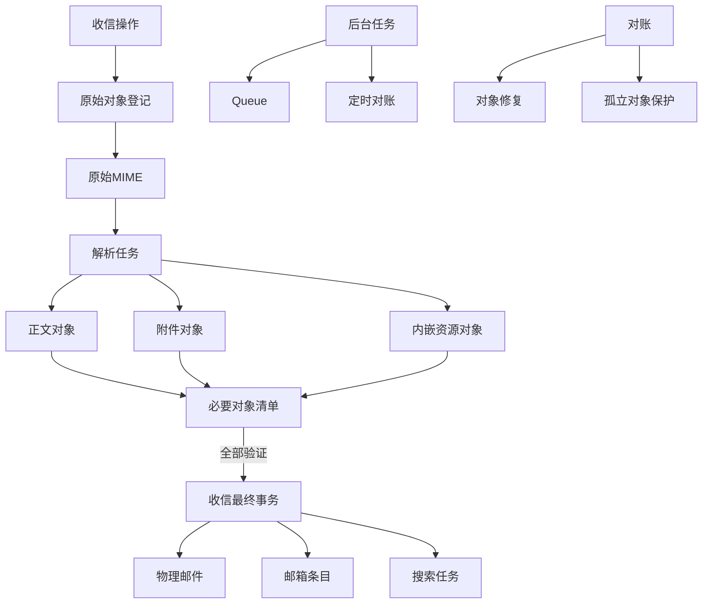

# 澄笺 | Simlettra 第四批数据模型确认清单

## 文档状态

- 状态：当前，已接受
- 建立日期：2026-08-10
- 接受日期：2026-08-10
- 对应阶段：正式数据模型设计
- 依据：[需求基线](../需求/需求基线.md)、[数据模型设计总纲](数据模型设计总纲.md)、[候选目标架构](../架构/候选目标架构.md)和状态为“已接受”的架构决策记录
- 相关决策：[0002 以 D1 保存权威状态并以对象存储保存邮件内容](../架构决策记录/0002-以D1保存权威状态并以对象存储保存邮件内容.md)、[0003 使用 Cloudflare Queues 唤醒异步任务](../架构决策记录/0003-使用CloudflareQueues唤醒异步任务.md)、[0008 限制 MIME 解析资源并保留原始邮件](../架构决策记录/0008-限制MIME解析资源并保留原始邮件.md)、[0009 采用可对账状态机协调 D1 与对象存储](../架构决策记录/0009-采用可对账状态机协调D1与对象存储.md)、[0010 采用供应商感知的域外发信状态机](../架构决策记录/0010-采用供应商感知的域外发信状态机.md)、[0013 采用权威数据逻辑备份并重建搜索索引](../架构决策记录/0013-采用权威数据逻辑备份并重建搜索索引.md)
- 本批新增决策：[0022 以统一对象登记和完整性状态管理邮件内容](../架构决策记录/0022-以统一对象登记和完整性状态管理邮件内容.md)、[0023 以有界防重和冻结路由完成可恢复收信](../架构决策记录/0023-以有界防重和冻结路由完成可恢复收信.md)、[0024 以 D1 任务租约和分批对账协调后台工作](../架构决策记录/0024-以D1任务租约和分批对账协调后台工作.md)
- 具体设计：[第四批数据模型设计](第四批数据模型设计.md)
- 迁移草案：[0004 对象、收信与后台任务](迁移草案/0004-对象收信与后台任务.sql)
- 验证结果：[第四批数据模型迁移草案验证结果](../验证/第四批数据模型迁移草案验证结果.md)
- 本批范围：原始 MIME、正文、附件、内嵌资源、对象登记、收信状态机、Queue 任务、租约、重试、死信、对账、修复和最终发信对象

## 怎样理解这一批

这一批回答的是“邮件已经到达系统以后，系统怎样把它完整保存下来，并在中途出错时继续完成”的问题。它不改变用户看到的功能，而是保护以下结果：

1. 邮件正文和附件不会只保存了一半就出现在收件箱；
2. 同一封邮件重复到达或后台任务重复执行时，不会生成第二封；
3. KV 与 R2 两种部署方式虽然速度不同，但不会出现两套互相矛盾的业务规则；
4. 临时故障可以自动恢复，确定性错误不会无限重试；
5. 对象损坏、任务卡住或 Queue 消息丢失时，管理员能看到问题并安全修复。

用户已经接受本批全部推荐；下表保留当时的确认问题、推荐结果和最终状态，供后续实现与变更追踪使用。

## 已经确定的边界

以下内容已经由需求基线或已接受的架构决策确定，本批不重新选择：

1. D1 保存用户、权限、邮件元数据、投递关系、任务状态和审计等权威数据；KV 或 R2 保存不可变邮件对象。
2. 首发同时支持 `D1 + KV` 和 `D1 + R2`，默认推荐 R2；两种方式提供相同产品功能和对象存储契约。
3. 接收总大小上限为 `20,000,000` 字节；实际运行受 Cloudflare 更小限制约束。解析器使用已锁定版本和资源边界。
4. 原始 MIME 先保存，再由 Queue consumer 异步解析；收信入口不因解析耗时而承担全部失败风险。
5. 对象写入前先建立 D1 登记，写完并校验大小与 SHA-256 后才允许进入下一状态。
6. 对象不在不同物理邮件之间共享；修复衍生对象使用更高代数的新键，不覆盖旧键。
7. 只有必要对象都已验证、D1 可见事务完成后，邮件才进入用户可见状态。
8. Queue 只负责尽快唤醒，D1 任务状态才是事实来源；定时任务负责找回遗漏、到期或卡住的任务。
9. 永久删除先撤销访问，再由可重试任务清理对象、搜索和缓存；孤立对象至少保护 24 小时，并经过两次独立对账。
10. 发信操作已经在第三批确定为一个不可修改的发送操作；最终发信对象必须能按实际完整邮件字节进行大小和完整性检查。

## 推荐方案

| 编号 | 需要决定的问题 | 推荐方案 | 用户能感受到的结果 | 状态 |
| --- | --- | --- | --- | --- |
| 数据-58 | 对象登记按什么粒度保存 | 每个不可变对象的每个邮件部件和每个代数各有一条登记；不把整封邮件的所有对象塞进一个 JSON，也不为 KV 和 R2 建两套表 | 系统能准确知道原始邮件、正文、每个附件和修复版本分别是否完整 | 已确认 |
| 数据-59 | 如何区分原始邮件、正文、附件和内嵌资源 | 使用固定的对象角色和邮件部件编号，例如 `raw_mime`、`plain_body`、`html_body`、`attachment`、`inline_resource`、`final_mime`；登记明确哪些对象是当前可见所必需的 | 同一封邮件的附件顺序、内嵌图片和正文版本不会混在一起，缺少某个必要对象时系统知道不能显示完整邮件 | 已确认 |
| 数据-60 | 收信、发信和迁移邮件的“原始内容”怎样定义 | 收信保留收到的原始 MIME；发信保留发送前冻结的最终 MIME；旧系统迁移若没有原始 MIME，则保存已迁移的结构化正文和附件并标记“无原始 MIME”，不伪装成完整原始邮件 | 导出或重新解析时，系统会诚实说明哪些邮件保留了原始文件，哪些是迁移后的结构化内容 | 已确认 |
| 数据-61 | 草稿附件怎样变成已发送邮件附件 | 草稿上传对象先属于草稿修订；发送前通过完整性检查复制或固化为物理邮件专属对象，并在最终 MIME 中使用固化后的内容；临时草稿对象由后续清理任务处理 | 发送成功后不会因为草稿被删除、冲突或过期而丢失附件，组织成员看到的是已经发送的准确版本 | 已确认 |
| 数据-62 | 对象的大小、哈希和内容信息保存在哪里 | D1 保存实际字节数、SHA-256、媒体类型、部件顺序、内容处置、内嵌 `Content-ID`、解析器版本和校验时间；正文和附件字节仍只放在 KV/R2 | 列表可以显示附件大小，系统能发现内容被截断或损坏，而数据库不会保存大段正文 | 已确认 |
| 数据-63 | 对象键和用户文件名怎样处理 | 对象键由服务端根据内部邮件编号、部件角色和代数生成，不含邮箱地址、主题、附件原名或可猜测信息；附件原名只作为不可信显示元数据保存 | 恶意附件名不会变成路径，用户也不能通过猜测链接绕过权限读取别人的对象 | 已确认 |
| 数据-64 | 对象登记需要哪些生命周期状态 | 使用明确状态区分“准备写入、已写入待校验、已验证、等待 KV 一致性、当前使用、已被新代数替代、缺失、损坏、待删除、已删除”；状态变更只允许按规定顺序发生 | 系统不会把“文件曾经写过”误当成“现在可以安全读取”，修复和删除也能从中断处继续 | 已确认 |
| 数据-65 | 邮件什么时候可以进入收件箱 | 为每封邮件建立必要对象清单；原始 MIME、可用正文表示和所有已解析附件等必要对象全部验证后，才在一个 D1 事务中建立可见邮箱关系。搜索索引是后续任务，不阻塞首次可见 | 邮件不会出现只有主题没有附件、附件只有文件名没有内容的半完成状态；新邮件可以先读，搜索索引稍后补齐 | 已确认 |
| 数据-66 | KV 和 R2 的差异如何放进数据模型 | D1 只保存统一的对象登记字段，另存少量后端类型、对象版本或校验标识；R2 校验后可直接继续，KV 需要进入“等待一致性”并由任务再次确认，不复制两套业务表 | 更换部署模式不会改变收件箱和恢复规则，KV 传播较慢时邮件会延迟可见而不是显示坏附件 | 已确认 |
| 数据-67 | 重复收信怎样识别，同时允许用户再次发送相同内容 | 接收适配器优先使用来源提供的稳定事件编号；没有编号时，使用原始字节、信封发件人、实际投递地址和有限时间窗口生成有界防重键。纯内容哈希不永久代表唯一邮件，窗口外的再次发送仍可保存 | 平台重试不会产生重复邮件，用户隔很久再次发送同样内容也不会被永久吞掉 | 已确认 |
| 数据-68 | 收信时的实际地址和路由决定是否冻结 | 在接收操作中保存信封发件人、实际投递地址、命中的地址身份或未分配地址时期、当时的域名和暂停状态快照；后续配置变化不改写这次已接受的投递事实 | 地址后来改名、释放或暂停时，历史邮件仍能说明当时为什么进入这个邮箱 | 已确认 |
| 数据-69 | MIME 解析失败怎样保存和重试 | 原始 MIME 继续保留且邮件保持不可见；保存有限的错误代码、解析器版本、部件数量和发生时间，不保存无限增长的诊断原文。临时读取或平台故障可重试，格式错误和结构超限转为需处理状态 | 系统不会显示坏掉一半的邮件，也不会因为同一个坏文件无限消耗配额；管理员能知道需要修复或人工处理 | 已确认 |
| 数据-70 | 一次收信操作的状态怎样表达 | 使用一个稳定收信操作编号，依次记录接收意图、原始对象存在、解析中、衍生对象存在、等待一致性、提交中、可见、解析失败、损坏或拒收等状态；每次重试推进同一操作，不新建第二封邮件 | 页面刷新、Queue 重复消费或 Worker 中断后，系统能从上次完成的位置继续 | 已确认 |
| 数据-71 | 收信最终提交一次写入哪些关系 | 在一个 D1 `batch()` 中同时建立物理邮件、邮件头地址、实际投递、个人或组织邮箱条目、附件元数据、最终防重关系和搜索任务，并把收信操作改为完成；任一确定性校验失败则整批不提交 | 邮件、收件人、附件列表和邮箱视图不会互相缺一块，重复执行也不会生成重复邮箱条目 | 已确认 |
| 数据-72 | 后台任务使用一张表还是各模块各建一张 | 使用一张统一的 `background_tasks` 权威任务表，保存任务类型、目标编号、步骤版本、状态、下一次执行时间和最后一次安全错误；模块专属结果仍保留在自己的业务表中 | 管理员可以在一个地方判断收信、解析、发信、清理和对账任务是否卡住，而不是到处寻找 | 已确认 |
| 数据-73 | 两个 Worker 同时处理同一任务怎么办 | 领取任务时使用有条件更新、租约到期时间和递增的领取令牌；完成或失败时必须带上领取令牌，旧 Worker 即使晚到也不能覆盖新 Worker 的结果 | Queue 重复消息或超时重投不会让同一封邮件被重复解析、重复发送或重复删除 | 已确认 |
| 数据-74 | 重试次数和等待时间是否统一 | 按任务类型和错误类别设置指数退避、有限随机扰动、最大尝试次数或最大等待期限；确定性错误不重试，暂时耗尽的任务转为需处理并保留下一步建议 | 临时网络问题会自动恢复，持续失败会明确停下来，不会无限重试把免费额度耗尽 | 已确认 |
| 数据-75 | Queue 消息中放什么 | 消息只放任务编号、任务版本和唤醒原因，不放正文、附件、密码、令牌、供应商密钥或完整回调原文；消费者总是回到 D1 检查当前状态 | 消息重复、延迟或泄露时，不会直接暴露邮件内容，也不会用过期消息覆盖新状态 | 已确认 |
| 数据-76 | 任务多次失败后的“死信”怎样处理 | 不把 Queue 的死信列表作为唯一事实；D1 将任务标为“需要处理”，记录安全错误摘要和人工可选动作。管理员只能执行受支持的继续、重新排队或取消，所有动作写入审计 | 系统不会把失败任务藏在 Cloudflare 后台，管理员能看到并安全决定是否继续，不会误删邮件 | 已确认 |
| 数据-77 | 定时对账怎样既可靠又不耗尽免费额度 | D1 任务扫描使用时间边界和游标分批执行；对象列举、缺失检查、孤立检查和状态修复分开排队，并保存上次游标、批次编号和结果摘要，不在一次请求中全量扫描 | 数据量变大时，后台仍能逐步检查，不会因为一次维护请求超时而留下没人知道的半完成状态 | 已确认 |
| 数据-78 | 已可见邮件的对象损坏怎样修复 | 缺少或哈希不符的正文、HTML、附件或内嵌资源先撤销该邮件的可见邮箱关系；从可信原始 MIME 生成更高代数的新对象，全部验证后再恢复可见。原始 MIME 也损坏时进入“损坏”并告警，不能伪造修复成功 | 用户宁可暂时看到“正在修复”，也不会下载到错误附件；原始数据不存在时系统会明确说明需要备份恢复 | 已确认 |
| 数据-79 | 最终发信内容如何与发送状态关联 | 发送操作接受前冻结最终 MIME 对象并记录字节数、SHA-256 和生成版本；每次供应商尝试引用同一冻结内容，并额外记录供应商实际提交的完整负载大小或等价负载摘要 | 重试不会悄悄换正文或附件，管理员能解释为什么某次发信受 5 MiB、20,000,000 字节或供应商条件限制 | 已确认 |

## 推荐的数据关系

## 推荐的关键状态边界

1. **已接收不等于已可见**：原始 MIME 写入成功后，邮件仍处于后台处理状态；只有必要对象和 D1 关系都完成，用户才会在邮箱中看到它。
2. **Queue 不是真相**：Queue 只负责唤醒。消息丢失、重复或延迟时，D1 任务记录仍能让定时任务重新安排工作。
3. **对象校验先于可见提交**：实际大小和 SHA-256 不匹配时，不建立可见邮箱条目，也不通过“看起来有文件”来掩盖问题。
4. **可重试与确定性失败分开**：网络中断、临时读取失败和 KV 传播等待可以重试；格式错误、结构超限和哈希不符必须转为明确的需处理或损坏状态。
5. **旧执行者不能覆盖新执行者**：任务租约过期后重新领取会生成新的领取令牌，迟到的 Worker 只能放弃更新。
6. **修复不覆盖旧对象**：修复使用更高代数的新对象键，验证完成后才切换 D1 当前引用，旧代数进入后续清理流程。
7. **搜索可以晚于可见**：搜索索引是派生数据；恢复或首次收信时可以先提供读信，索引重建完成前搜索必须明确显示仍在建立中。

## 本批不决定的内容

以下内容留给后续批次或实现阶段：

1. `background_tasks` 和 `object_registry` 的最终字段类型、索引名称与正式 SQL 迁移编号。
2. 不同任务类型的默认最大尝试次数、退避秒数和管理员界面文案；这些需要结合真实 Cloudflare 配额和测试结果调整。
3. 第五批通知、转发和三家外部服务配置的具体表结构；本批只保留任务和对象的通用边界。
4. 第六批永久删除、备份、恢复、导出、配额和迁移对账的完整保留期限；本批只定义对象损坏、孤立和任务卡住时如何保持安全。
5. 解析失败邮件是否向普通用户显示专门的占位提示；本批先保证不出现半封可见邮件，并保证管理员能看到不含正文的告警。
6. 是否允许整套系统在运行中从 KV 切换到 R2 或反向切换；当前部署方式在初始化时确定，切换流程另行评估。

## 确认记录

用户于 2026-08-10 确认“第四批数据模型全部按推荐”。数据-58 至数据-79 均已确认，并由 ADR `0022` 至 `0024`、第四批具体设计和 `0004` 迁移草案承接。

本批决定现在属于正式数据模型事实。后续若改变对象代数、可见性门槛、收信防重、冻结路由、任务租约、死信或分批对账规则，必须建立新的架构决策记录取代现有结论，并同步修改设计、迁移和验证文档。
