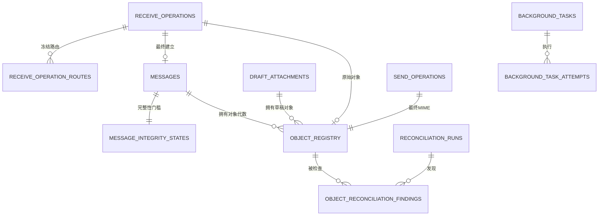

# 澄笺 | Simlettra 第四批数据模型设计

## 文档状态

- 状态：当前，已接受
- 建立日期：2026-08-10
- 接受日期：2026-08-10
- 对应确认：[第四批数据模型确认清单](第四批数据模型确认清单.md)
- 对应决策：[0022 以统一对象登记和完整性状态管理邮件内容](../架构决策记录/0022-以统一对象登记和完整性状态管理邮件内容.md)、[0023 以有界防重和冻结路由完成可恢复收信](../架构决策记录/0023-以有界防重和冻结路由完成可恢复收信.md)、[0024 以 D1 任务租约和分批对账协调后台工作](../架构决策记录/0024-以D1任务租约和分批对账协调后台工作.md)
- 迁移草案：[0004 对象、收信与后台任务](迁移草案/0004-对象收信与后台任务.sql)
- 验证结果：[第四批数据模型迁移草案验证结果](../验证/第四批数据模型迁移草案验证结果.md)

## 设计范围

本设计把数据-58 至数据-79 转换成具体 D1 表关系、对象代数、收信状态、任务租约和对账边界。它覆盖原始 MIME、正文、附件、内嵌资源、草稿附件、最终发信 MIME、收信防重、冻结路由、后台任务、任务尝试和对象对账。

第四批不建立 KV 或 R2 中的真实对象，也不实现 Worker、Queue consumer、MIME 解析器或对象存储适配器。迁移文件仍位于“迁移草案”目录，不是已经进入生产 `migrations/` 账本的正式迁移。

## 新增表与模块所有权

| 表 | 所属模块 | 保存内容 | 权威性 |
| --- | --- | --- | --- |
| `object_registry` | 邮件对象 | 每个不可变对象代数的键、角色、大小、哈希、后端、状态和邮件或草稿归属 | 对象存在与完整性的权威账本 |
| `message_integrity_states` | 邮件对象 | 物理邮件的来源完整度、当前对象集合版本和可见完整性状态 | 邮件内容能否被读取的权威门槛 |
| `receive_operations` | 收信 | 收信防重、预留邮件引用、原始对象、解析结果和工作流状态 | 收信过程的权威状态 |
| `receive_operation_routes` | 收信 | 每个实际投递地址在接受时冻结的域名、地址归属、未分配时期和最终投递 | 路由事实与最终投递的权威关系 |
| `background_tasks` | 运维与任务 | 通用任务身份、目标、租约、领取令牌、下一次执行和当前结果 | 后台任务的权威状态 |
| `background_task_attempts` | 运维与任务 | 每次领取的开始、结束、结果和安全错误摘要 | 执行历史 |
| `reconciliation_runs` | 运维与任务 | 一次分批任务或对象对账的存储模式、游标、计数和结果 | 对账进度与结果摘要 |
| `object_reconciliation_findings` | 邮件对象 | 孤立、缺失和哈希不符对象的首次、最近与重复观察 | 修复或孤立删除的权威依据 |

第四批还为现有表补充关系：

1. `message_deduplication_keys.receive_operation_id` 把最终防重记录关联到收信操作。
2. `send_operations.final_mime_object_id` 和 `payload_generator_version` 把发送操作关联到冻结的最终 MIME 与生成版本。
3. 新增邮箱条目触发器，要求物理邮件完整性状态为 `ready`；正常查询也必须加入相同条件。

## 核心关系

## 对象登记

`object_registry` 一行代表一个确定的不可变对象代数。对象的逻辑身份由以下字段组成：

1. `owner_kind`：`message` 或 `draft_attachment`。
2. `owner_reference`：预留物理邮件编号或草稿附件编号。
3. `object_role`：原始 MIME、正文、附件、内嵌资源、草稿附件或最终 MIME。
4. `logical_part_key`：同一邮件内部稳定的部件编号，例如 MIME 部件路径。
5. `generation`：从 1 开始递增的对象代数。

同一逻辑部件同一代数唯一，同一时刻最多一个对象标记为当前。对象键本身唯一，但不承担业务归属；所有读取先通过 D1 邮箱权限和完整性状态，再取得当前对象键。

消息对象可以在 `messages` 行建立前登记：此时 `owner_reference` 已经是预留邮件编号，`message_id` 为空。最终提交创建同名 `messages` 行后，只允许把 `message_id` 从空设置为 `owner_reference`，不能改指或解除。草稿附件已经具有稳定行，因此从登记开始就引用 `draft_attachment_id`。

## 对象角色与元数据

正式角色为：

| 角色 | 所有者 | 含义 |
| --- | --- | --- |
| `raw_mime` | 物理邮件 | 收到的原始 RFC 822/MIME 字节 |
| `plain_body` | 物理邮件 | 解析后的纯文本正文 |
| `html_body` | 物理邮件 | 解析后的原始 HTML 正文，仍视为不可信内容 |
| `attachment` | 物理邮件 | 普通附件 |
| `inline_resource` | 物理邮件 | 通过 `Content-ID` 等方式供正文引用的内嵌资源 |
| `final_mime` | 物理邮件 | 发信前冻结的最终 RFC 822/MIME 字节 |
| `draft_attachment` | 草稿附件 | 已上传并校验、尚未固化到物理邮件的附件 |

每个对象保存预期和实际字节数、预期和实际 SHA-256。只有两者完全相同才能进入 `verified` 或 `active`。后端 ETag、版本号或 KV/R2 返回标识只用于诊断。

媒体类型、不可信文件名、内容处置、`Content-ID`、显示顺序和生产者版本保存在 D1。附件名不进入对象键，应用输出时还必须执行 HTML 转义、下载头编码和控制字符处理。

## 对象状态与代数

对象状态如下：

| 状态 | 含义 |
| --- | --- |
| `write_intent` | D1 已登记预期对象，KV/R2 写入尚未确认 |
| `stored` | 写入返回，等待内容校验 |
| `waiting_consistency` | KV 模式中等待跨位置可见和再次校验 |
| `verified` | 实际大小与 SHA-256 已验证，尚未成为当前活动对象 |
| `active` | 当前活动代数，可以参与完整邮件 |
| `superseded` | 已被更高代数替代 |
| `missing` | 已确认当前对象不存在 |
| `damaged` | 已确认内容哈希或大小错误 |
| `pending_delete` | 已撤销当前引用，等待幂等物理删除 |
| `deleted` | 物理删除完成 |

R2 通常从 `stored` 进入 `verified`；KV 可以先进入 `waiting_consistency`，由后续任务重新读取并校验。`active`、`missing` 和 `damaged` 可以暂时保持当前标记，使系统知道需要修复的是哪一代；新代数验证后，在同一 D1 批次中把旧代数改为 `superseded`、把新代数改为 `active` 并增加邮件对象集合版本。

## 邮件完整性门槛

`message_integrity_states` 与 `messages` 一一对应。来源完整度为：

1. `raw_mime`：收信或迁移邮件保留了原始 MIME。
2. `final_mime`：系统编写邮件保留了最终发信 MIME。
3. `structured_only`：迁移邮件只有结构化正文和附件。

完整性状态为 `ready`、`repairing`、`damaged` 或 `pending_delete`。只有 `ready` 可以通过普通邮箱、会话、搜索结果打开正文和附件。邮箱条目仍然保存，进入修复时通过服务端查询条件立即隐藏，避免删除邮箱条目时连带丢失用户星标、已读和垃圾箱状态。

进入 `ready` 必须满足：

1. 至少存在一个当前且活动的必要对象；
2. 收信来源具有当前活动 `raw_mime`；
3. 系统编写来源具有当前活动 `final_mime`；
4. 至少具有一个当前活动的 `plain_body` 或 `html_body`；没有正文的邮件也生成零字节纯文本正文对象；
5. 当前必要对象均为 `active`；
6. `messages.attachment_count` 等于当前活动普通附件对象数量；
7. 每个消息对象已经附着到同名 `messages` 行。

搜索索引不属于必要对象，不阻塞 `ready`。但搜索服务必须依据索引任务状态说明“正在建立”或“正在重建”，不能返回不完整结果冒充完整结果。

## 收信操作与有界防重

`receive_operations` 在收信入口首先建立。它保存：

1. 来源类型、可选来源事件引用和防重类型；
2. 32 字节防重摘要，以及有界指纹的窗口开始与结束时间；
3. 预留物理邮件编号、原始对象编号和原始字节摘要；
4. 信封发件人、接受时间、解析器版本、部件数量和有限错误；
5. 当前工作流状态、可见时间和完成时间。

来源事件防重可以没有到期时间；有界指纹必须具有严格的时间窗口，摘要应包含窗口标识。这样，同一窗口内的路由重试命中原操作，下一窗口中的相同邮件可以建立新操作。

最终提交后，在第二批 `message_deduplication_keys` 建立最终防重关系并引用收信操作。收信操作即使以后清理详细解析错误，也要保留满足重放保护所需的最小身份和结果。

## 冻结路由

`receive_operation_routes` 每行代表一个实际投递地址。已接受路由保存域名、地址身份与当时的 `address_bindings`，或保存 `unallocated_address_periods`；已拒绝路由只保存安全拒绝代码。

已接受路由不能重新查询当前地址归属后改指。最终提交时建立第二批 `message_deliveries`，然后把路由从 `accepted` 更新为 `committed` 并关联该投递。触发器验证：

1. 实际投递属于收信操作最终物理邮件；
2. 规范地址、显示地址和 assigned/unallocated 目标与冻结快照相同；
3. 同一收信操作内同一规范收件地址只有一条路由。

## 收信状态机与最终事务

收信操作状态依次覆盖：

`intent`、`raw_stored`、`parsing`、`derived_stored`、`waiting_consistency`、`committing`、`visible`、`parse_failed`、`damaged`、`rejected`、`needs_attention`。

通常路径为：

1. 建立接收意图和冻结路由。
2. 建立原始对象写入意图，写 KV/R2，校验后进入 `raw_stored`。
3. Queue consumer 领取解析任务，把操作改为 `parsing`。
4. 写入正文、附件和内嵌资源对象；全部校验后进入 `derived_stored`。
5. KV 模式需要时进入 `waiting_consistency`，R2 可以直接进入 `committing`。
6. 一个 D1 批次创建物理邮件、附着并激活对象、建立完整性状态、邮件头、投递、邮箱条目、最终防重关系和搜索任务，再把路由与操作改为完成。

解析失败保留原始对象。临时错误通过后台任务重试；确定性错误进入 `parse_failed` 或 `needs_attention`。错误字段只能保存有限代码、有限摘要和解析统计，不保存正文或附件内容。

## 通用后台任务

`background_tasks` 是所有异步工作的权威调度表。`task_key_digest` 对同一逻辑工作唯一，至少由任务类型、目标引用和输入版本生成。任务状态为：

| 状态 | 含义 |
| --- | --- |
| `pending` | 等待首次领取 |
| `running` | 当前租约持有者正在执行 |
| `retry_wait` | 临时失败，等待下一次时间 |
| `needs_attention` | 自动处理已停止，等待管理员支持的动作 |
| `succeeded` | 已完成 |
| `cancelled` | 已明确取消 |

任务领取必须在一个条件更新中完成：状态可领取、到达 `next_attempt_at`、租约为空或已经过期，然后增加 `attempt_count` 与 `lease_token`，写入租约所有者和到期时间。续租和完成必须带当前 `lease_token`；应用服务的更新条件不匹配时，说明执行者已经失去所有权，必须放弃写回。

`max_attempts` 是任务建立时冻结的策略快照，不代表所有任务使用同一个数值。确定性错误可以在第一次尝试后进入 `needs_attention`；临时错误由应用计算指数退避和有限随机扰动，并写入新的 `next_attempt_at`。

## 任务尝试与人工处理

每次成功领取任务建立一条 `background_task_attempts`。尝试编号和领取令牌必须与任务当前领取一致。尝试从 `running` 结束为 `succeeded`、`retry_scheduled`、`needs_attention`、`cancelled` 或 `abandoned`，终态不可再次修改。

Queue 消息不会进入 D1 长期保存；其契约只有任务编号、任务版本和唤醒原因。管理员重新排队会修改 D1 任务状态并由应用补充审计，不能通过直接投递一条伪造 Queue 消息跳过状态检查。

## 分批对账与对象发现

`reconciliation_runs` 保存一次任务扫描、对象库存、对象完整性或孤立对象复核。每一批保存稳定游标、批次编号、扫描数量、发现数量和修复数量；暂停或失败后从游标继续。

`object_reconciliation_findings` 保存三种发现：

1. `orphan`：对象存储存在，但 D1 没有对应登记；使用对象键保存待处理目标。
2. `missing`：D1 当前对象登记存在，但对象存储读不到。
3. `hash_mismatch`：对象存在，但大小或 SHA-256 不匹配。

同一对象同一类型同时只有一条开放发现。每次不同对账批次再次确认时增加观察次数并更新最近批次。孤立对象只有 `observation_count >= 2`，且计划删除时间不早于 `protected_until` 时，才能进入 `delete_scheduled`。缺失或哈希不符对象进入修复或告警，不能使用孤立删除流程。

## 最终发信 MIME

第四批为 `send_operations` 增加最终 MIME 对象引用和生成器版本。创建发送操作时必须验证：

1. 对象属于同一 `message_id`；
2. 角色为 `final_mime`，是当前活动代数；
3. 对象实际大小和 SHA-256 与 `send_operations.payload_size_bytes` 和 `payload_sha256` 相同；
4. `message_integrity_states` 为 `ready` 且来源完整度为 `final_mime`。

第三批 `provider_submission_attempts` 已经保存每次实际提交的负载大小与摘要，并要求匹配发送操作。因此最终 MIME、发送操作和供应商尝试形成连续证据链。供应商使用结构化 API 时，适配器仍必须对等价完整提交负载做确定性测量；不能只计算附件原文件大小。

## 权限、可见性与隐私

1. 对象下载必须先验证邮箱条目归属或当前组织成员关系，再验证邮件完整性为 `ready`，最后读取当前对象。
2. 内部对象键不作为长期公开 URL，也不能单独证明访问权限。
3. 组织成员退出后，即使知道对象键也不能访问组织邮件。
4. `background_tasks`、任务尝试、解析错误和对账结果不保存正文、附件内容、密码、令牌、密钥或完整回调。
5. 系统管理员可以查看任务类型、时间、错误代码、对象数量和健康状态，不能通过运维表读取普通用户正文。

## 关键唯一与状态约束

1. 对象键全局唯一；同一所有者、角色、逻辑部件和代数唯一；同一逻辑部件同时只有一个当前代数。
2. 已校验对象的实际大小与 SHA-256 必须等于预期值。
3. 物理邮件引用只能从未附着变为同名 `messages` 行，不能改指或解除。
4. 每封物理邮件只有一个完整性状态；非 `ready` 邮件不能新建邮箱条目。
5. 同一来源与防重摘要只有一个收信操作。
6. 同一收信操作同一规范收件地址只有一条冻结路由。
7. 已提交路由必须匹配同一邮件的实际投递。
8. 同一任务摘要只有一条任务；尝试编号在任务内唯一，领取令牌单调增加。
9. 同一开放对象发现不能重复；孤立删除必须满足保护期和至少两次观察。
10. 发送操作的最终 MIME 对象、大小、哈希和消息归属必须一致。

## 仍留待后续的事项

1. 第五批通知、转发、发信网关配置和通知网关配置的正式表结构。
2. 第六批备份、导出、恢复、永久删除、配额与审计表，以及任务和对账历史的保留期限。
3. 有界防重窗口、各任务最大尝试次数、退避区间和租约时长的生产默认值。
4. 解析失败邮件是否向普通用户显示占位提示；当前只保证普通邮箱不显示半封邮件且管理员收到安全告警。
5. 在线 KV 与 R2 互相切换的迁移流程；当前只保证两种初始化部署共用数据契约。
6. 正式应用中的搜索任务表是否复用 `background_tasks` 并增加搜索范围专属表，由搜索实现切片决定。

## 验证要求

1. 从第一批开始顺序执行四份迁移草案，外键检查为零。
2. 验证对象角色、所有者、状态、时间、大小、哈希、当前代数和消息附着约束。
3. 验证收信、发信与结构化迁移邮件的完整性来源要求。
4. 验证非就绪邮件不能新增邮箱条目，修复中的邮件必须通过查询条件隐藏。
5. 验证来源事件和有界指纹防重、冻结路由与最终实际投递匹配。
6. 验证收信操作不能跳过必要阶段，最终可见必须具备完整对象、投递和防重关系。
7. 验证任务领取令牌递增、旧令牌不能完成、重试与需处理状态形状正确。
8. 验证对账游标、开放发现唯一、保护期和两次独立观察条件。
9. 验证发送操作最终 MIME 的对象归属、大小和 SHA-256 与供应商尝试一致。
10. 在失败事务后确认没有半封可见邮件、已提交路由或错误任务终态。

上述数据库验证完成后，仍需在真实 Cloudflare D1、KV、R2、Queue 和 Worker 中验证多地区一致性、并发领取、20 MB 对象处理、定时扫描成本和实际限制。

本地验证已于 2026-08-10 完成：四批草案顺序建立 46 张表，63 项结构、对象完整性、收信、最终 MIME、任务租约、对账和失败事务断言全部通过，`PRAGMA foreign_key_check` 为零。该结果不替代上述真实 Cloudflare 环境验证。
