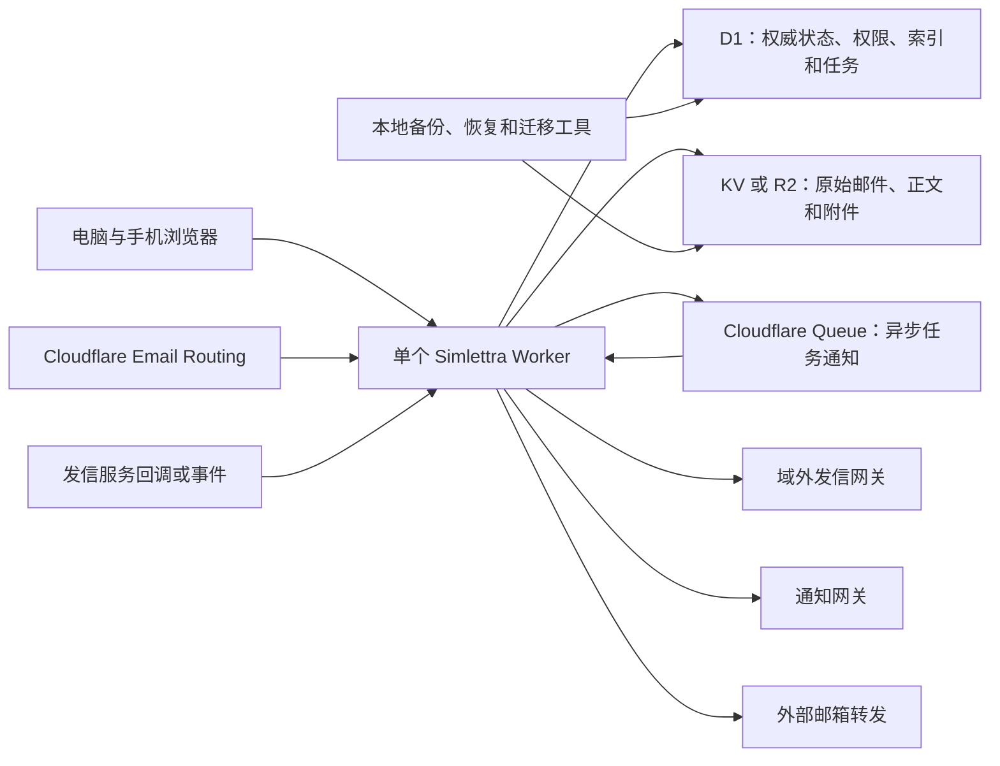

# 澄笺 | Simlettra 目标架构

## 文档状态

- 状态：第一批至第七批架构已接受，免费资源范围正在重新收口
- 建立日期：2026-08-09
- 第一批至第七批接受日期：2026-08-10
- 依据：`需求基线-0001`、架构约束、旧系统观察和 Cloudflare 平台核验
- 目的：记录已接受的整体结构、技术职责和仍需验证的风险

## 一句话方案

Simlettra 将建成一个**单 Worker 部署的模块化单体应用**：D1 是权威账本，KV 或 R2 是邮件对象仓库，一个 Cloudflare Queue 负责唤醒异步任务，同一个 Worker 同时处理网页、接口、收信、队列、定时任务和供应商事件。

“模块化单体”可以理解为：对外只有一套房子，屋内按用途分成清楚的房间；部署简单，但身份、邮件、组织、发信和备份不会混在一起。

## 总体结构



## 单 Worker 的四个入口

1. **网页与接口入口 `fetch`**：提供静态网页、登录、邮箱操作、管理接口和 HTTP 回调。
2. **收信入口 `email`**：完成大小及路由检查，保存原始邮件并建立待处理记录，然后投递任务。
3. **任务入口 `queue`**：解析邮件、生成索引、站外发信、通知、转发和清理对象。
4. **维护入口 `scheduled`**：重投遗漏任务、执行保留期清理、重置配额、检查孤立对象和记录健康状态。

四个入口属于同一个 Worker 脚本，不形成多个 Worker 服务。

## 推荐的内部模块

| 模块 | 主要职责 |
| --- | --- |
| 系统与初始化 | `init_key`、初始化状态、系统配置、版本和健康检查 |
| 身份与会话 | 用户、密码、会话、管理员转让、注销和频率限制 |
| 域名与地址 | 域名配置、主地址、别名、地址唯一性、暂停和保留期 |
| 组织 | 组织、成员、邀请、创建者继承和组织发件权限 |
| 收信 | 路由检查、去重、解析、对象保存、投递和全域收信 |
| 邮箱 | 邮件列表、成员个人状态、会话归并、搜索和附件访问 |
| 草稿与发信 | 服务端草稿、混合投递、发信操作、重试和状态事件 |
| 通知与转发 | 五种通知通道、外部邮箱转发、失败状态和重试 |
| 数据生命周期 | 垃圾箱、永久删除、导出、配额、备份、恢复和迁移 |
| 运维与审计 | 操作记录、任务状态、用量、告警和故障诊断 |

模块通过明确的应用服务协作。网页路由只负责输入输出，不能直接包含核心权限和状态规则。

## 邮件数据模型

新系统不再把“一封物理邮件”和“某个用户看到的邮件”放在同一行中。收信与邮箱视图拆为四层：

1. **邮件 `message`**：物理邮件的唯一记录，保存主题、发件人、时间、去重指纹、会话关系和对象引用。
2. **投递 `delivery`**：记录邮件实际投递到哪个系统地址，以及属于个人、组织还是未分配地址。
3. **邮箱条目 `mailbox_entry`**：说明某封邮件出现在个人邮箱或组织邮箱中，是收件还是已发送。
4. **成员状态 `mailbox_state`**：保存某个用户对该条目的已读、星标、归档和垃圾箱状态。

这样可以自然满足：同一封邮件只保存一次、多个本地地址都能看到、组织成员状态互相独立、成员退出后失去访问权。

草稿与发信在上述四层之外增加四类独立记录：

1. **草稿与当前修订**：草稿属于实际编辑者，保存当前内容、收件人、已完成附件和修订号；过期设备产生可恢复冲突副本。
2. **发送操作**：一次发送只建立一个操作、一封不可修改物理邮件和一个个人或组织已发送条目，并冻结发件身份、最终负载、域名发信路线及额度单位。
3. **逻辑收件人**：每个去重后的最终收件人独立保存站内或站外通道和投递状态；站内收件人引用实际投递，站外收件人进入供应商尝试。
4. **供应商路线、尝试与事件**：每个域名按顺序配置默认和备用 Provider；每名站外收件人选择冻结路线中最靠前且兼容的服务。外部调用前登记尝试，回调通过鉴权后保存最小不可变事件；只有明确未接受时才能切换备用，结果未知不能自动重试或改走其他服务。

这些边界最初由第三批数据模型和 ADR `0019` 至 `0021` 接受，具体关系见[第三批数据模型设计](../数据模型/第三批数据模型设计.md)。对象代数、最终 MIME 和后台任务关系随后由第四批数据模型及 ADR `0022` 至 `0024` 接受。第五批数据模型及 ADR `0025` 至 `0027` 又以加密 D1 凭据、域名级优先路线和独立通知/验证/转发操作取代单一 Provider 配置假设，具体关系见[第五批数据模型设计](../数据模型/第五批数据模型设计.md)。

## 邮件对象存储

对象存储中保存：

1. 原始 MIME 邮件，用于导出、迁移核对和重新解析。
2. 解析后的 HTML 与纯文本正文。
3. 普通附件和内嵌附件。

对象键由稳定内部引用、对象角色、逻辑部件和代数组合生成，不使用邮箱地址、主题或附件名。D1 保存对象键、大小、SHA-256、当前代数和引用关系；内容哈希用于校验，不作为跨邮件共享键。KV 与 R2 共用同一接口：

- R2 是推荐模式，容量、操作额度和强一致性更适合邮件。
- KV 是低写入兼容模式，只使用唯一键写入不可变对象，不承担会话、权限或计数。

## 收信状态机

推荐流程：

1. 检查域名、地址、暂停状态和邮件大小。
2. 优先使用可信来源事件编号防重；没有稳定编号时使用原始摘要、信封和时间窗口生成有界指纹，建立或找到同一收信操作。
3. 把原始邮件写入 KV/R2。
4. 在 D1 中建立“已接受、待解析”记录。
5. 把任务编号写入 Queue；失败则让外部路由重试。
6. Queue consumer 解析正文和附件，写入不可变对象。
7. 使用 D1 事务一次性建立邮件、对象附着与完整性状态、投递、邮箱条目、最终防重关系、附件元数据和搜索任务。
8. 确认全部必要对象、可显示正文和最终关系存在后，才把邮件状态改为“可见”。

任一步重复执行都使用同一操作编号，不创建第二封邮件。定时任务负责找出没有完成的步骤并重投。

第四批数据模型已经把上述流程落实为 8 张新增表，并以 D1 任务租约、递增领取令牌和分批对象对账承接 Queue 重复、遗漏与故障恢复。四批草案已在本地顺序建立 46 张表并通过 63 项验证断言，详细证据见[第四批数据模型迁移草案验证结果](../验证/第四批数据模型迁移草案验证结果.md)。

## 发信状态机

推荐流程：

1. 在 D1 中先建立唯一发信操作和收件人级任务。
2. 保存已发送邮件正文和附件对象，但状态仍为“等待发送”。
3. 系统内收件人通过 D1 事务直接建立投递。
4. 站外收件人从发件域名的冻结路线中选择最靠前且兼容最终 MIME 的 Provider，并由 Queue consumer 调用。
5. 当前 Provider 明确未接受且错误允许切换时，才为对应收件人选择冻结路线中的下一家服务。
6. 支持幂等键的供应商使用同一操作编号；网络中断导致结果不确定时标记“结果未知”，不自动重发或切换备用。
7. 回调或事件更新各收件人的已提交、已送达、延迟、退信或失败状态。

这种顺序避免“邮件已经发出，但系统没有保存记录”的旧系统问题。

## 搜索

使用 D1 FTS5 建立可重建搜索索引：

1. 主题、发件人、收件人和附件名进入结构化索引。
2. 正文纯文本按固定大小分块写入搜索表，避免单行 2 MB 限制。
3. 连续中文生成相邻双字词元；首发中文正文全文搜索至少输入两个汉字，不建立单汉字全量索引。
4. 每个正文分块加入稳定的个人邮箱或组织邮箱范围编号，先缩小候选集合。
5. 搜索结果再经过邮箱所有权或当前组织成员资格检查，范围词元不能代替授权。
6. FTS5 使用内容空表，索引不进入权威恢复链；恢复后从正文对象重新生成。

2026-08-10 的本地原型已经完成第一轮验证：默认 `unicode61` 不能可靠匹配中文子串，`trigram` 不能匹配两个汉字；应用生成双字词元可以正确匹配两个及以上汉字。邮箱范围词元还把常见词搜索读取行数降低约 95.5%。详细证据见[中文搜索与 D1 规模验证结果](../验证/中文搜索与D1规模验证结果.md)。用户已接受第二批架构，对应 ADR `0007` 状态为“已接受”；真实 Cloudflare D1 仍需发布前复核。

## 身份与会话

1. 密码使用平台可稳定运行的成熟慢速哈希方案，参数保存在密码记录中，允许以后逐步升级。
2. 登录成功后生成随机会话令牌；D1 只保存令牌哈希和会话信息。
3. 浏览器通过 `HttpOnly`、`Secure`、适当 `SameSite` 的 Cookie 携带会话。
4. 修改密码、禁用用户、注销账号和管理员转让可以撤销相关会话。
5. `init_key` 只存在于受保护部署配置，初始化和管理员恢复必须限速并留下不含密钥的审计记录。

2026-08-10 的本地验证已经完成：三个密码算法候选均可运行，九组密码与会话场景全部通过。真实 Workers 随后确认单次 PBKDF2 超过 100,000 次会失败，当前实现使用 9 轮 × 100,000 次的链式 PBKDF2，总计算量保持 900,000 次；同时保留版本化密码记录、D1 会话令牌摘要、受保护 Cookie、CSRF 令牌、7 天空闲与 30 天绝对有效期。详细证据见[密码与会话验证结果](../验证/密码与会话验证结果.md)，单次派生结论由 ADR `0053` 取代 ADR `0011`。

## MIME 解析验证状态

接近 20 MB 邮件解析的本地原型已于 2026-08-10 完成，正确性、重复一致性、本地耗时和进程健康均通过，但真实 Worker 的 128 MB 内存余量尚未证明，因此结论为“有限通过”。详细证据见[接近 20 MB 邮件解析验证结果](../验证/接近20MB邮件解析验证结果.md)。

第三批架构原先确认：`20 MB` 按 20,000,000 个原始字节计算；通过适配器使用 `postal-mime`；原始邮件以 `ArrayBuffer` 解析且禁止先转成字符串；限制邮件头、MIME、RFC822 和附件数量；解析失败保留原始邮件。ADR `0008` 的这些结论继续有效，其 Workers Paid 基线已被取代。

2026-08-11 当前决定：ADR `0029` 规定首发核心闭环必须以 Workers Free 为运行基线；ADR `0030` 规定 20 MB 邮件解析先在真实 Workers Free Queue consumer 中验证，失败后再向用户提交可比较方案。当前不预先降低 20 MB，也不把 Workers Paid 作为隐藏前提。详见[免费资源目标影响评估](免费资源目标影响评估.md)。

## D1 数据访问与迁移验证状态

2026-08-10 的本地原型已经完成 11 组自动验证。Drizzle 与原生 D1 的组合查询结果一致，Drizzle 生成迁移、手写 FTS5 迁移和 Wrangler 迁移账本能够共存；失败迁移不会留下部分结构。Prisma D1 adapter 可以运行，但仍为 Preview，代表性 Worker gzip 包体约为 Drizzle 的 32.25 倍。

D1 物理导出明确拒绝包含 FTS5 虚拟表的数据库。原型改为备份全部权威普通表，恢复到新的 D1 后重建搜索索引，用户、邮件和邮箱条目数量全部一致。第七批架构已经确认采用 Drizzle 查询层、Wrangler 唯一迁移账本和权威数据逻辑备份。详细证据见[D1 数据库工具与迁移验证结果](../验证/D1数据库工具与迁移验证结果.md)，对应 ADR `0012`、`0013` 状态均为“已接受”。

## 对象故障恢复验证状态

D1 与 KV/R2 故障恢复原型已于 2026-08-10 完成。两种模式共 31 个本地场景通过，覆盖接收中断、最终可见事务回滚、提交后重试、KV 一致性等待、缺失与损坏对象修复、孤立对象对账和永久删除中断。详细证据见[KV 与 R2 故障恢复验证结果](../验证/KV与R2故障恢复验证结果.md)。

第四批架构已经确认：对象不跨邮件共享；D1 保存对象登记和哈希；全部对象校验后才原子提交可见；KV 增加一致性等待；衍生对象换新键修复，原始 MIME 丢失则明确告警；永久删除先撤销访问再后台清理；孤立对象经过保护期和重复对账后才删除。对应 ADR `0009` 状态为“已接受”。

## 域外发信验证状态

Cloudflare Email Sending、Resend 和 SMTP2GO 的历史本地网关契约原型已于 2026-08-10 完成，九组自动验证全部通过。该结果仍能证明通用状态机、最终 MIME 字节边界、安全重试、事件防重和乱序处理的候选设计，但其三家 Provider 范围已由 ADR `0028` 取代。历史证据见[三种域外发信服务验证结果](../验证/三种域外发信服务验证结果.md)，当前验证范围见[两种域外发信服务验证计划](../验证/两种域外发信服务验证计划.md)。

当前域外发信架构只支持 Resend 和 SMTP2GO：每个站外收件人保存独立状态；Resend 复用 24 小时幂等键并使用 Svix 验签；SMTP2GO 结果未知时不自动重发并使用 HTTPS Basic Auth 回调边界。每个域名配置两家 Provider 组成的默认和备用路线，只有明确未接受时才切换，结果未知时停止自动动作。ADR `0025` 规定 Provider 与通知凭据由独立主密钥加密后保存到 D1，ADR `0028` 取代 Cloudflare Email Sending 相关结论。

## 前端技术路线

项目采用以下技术职责划分，保留成熟生态但不复制旧页面代码：

1. 全项目使用 TypeScript，让地址类型、权限结果、邮件状态和接口契约更容易在编译期发现错误。
2. 网页使用 Vue 3 单页应用，从零重写交互和页面结构；旧品牌资源可以独立评估后复用。
3. 使用 Vite 和 Cloudflare 官方 Vite 插件完成本地开发与生产构建。
4. Hono 只负责 HTTP 接口、HTTP 中间件和路由组合，不承载业务核心。
5. `email`、`queue` 和 `scheduled` 直接使用 Worker 原生入口，共同调用应用服务。
6. 使用面向邮箱工作的轻量组件体系，不继承旧系统的多角色管理界面和页面结构。
7. 草稿以服务端为权威；浏览器本地只允许保存短期编辑缓存，不能成为唯一副本。

D1 结构通过版本化 SQL 迁移演进。普通类型安全查询采用 Drizzle，FTS5、PRAGMA、D1 Sessions 和平台特殊能力使用参数化原生 D1；生产迁移只由 Wrangler 迁移账本应用。

## 工程目录候选

```text
src/
  worker/          Worker 四类入口与组合根
  web/             Vue 网页应用
  modules/         按业务领域划分的模块
  shared/          稳定公共契约和少量通用能力
migrations/        只增不改的 D1 版本化迁移
tests/             单元、集成、契约和端到端测试
tools/             备份、恢复和旧系统迁移工具
```

使用一个根级包管理和统一命令，最终仍只生成一个 Worker 部署产物。

## 三种方案比较

| 方案 | 说明 | 优点 | 主要代价 | 结论 |
| --- | --- | --- | --- | --- |
| 方案一 | 模块化单体 + D1 权威状态 + KV/R2 对象 + Queue | 可靠任务、清晰状态、同一 Worker、适合外部事件 | 多一个 Queue 资源，需要幂等任务设计 | 推荐 |
| 方案二 | 模块化单体 + D1 任务表 + 定时扫描，不使用 Queue | 部署资源最少 | 通知和发信延迟更高，频繁扫描 D1，Cloudflare 发信事件仍需要 Queue | 不推荐作为完整首发 |
| 方案三 | 使用 Nuxt、SvelteKit 等全栈框架统一所有层 | 页面开发整合度高 | 邮件、队列和定时入口受框架约束更强，升级耦合更大 | 不推荐 |

## 已接受结论

用户于 2026-08-10 至 2026-08-11 依次接受第一批至第七批架构、第一批至第六批数据模型和后续替代性决定。当前架构决策记录已连续建立至 `0035`，各记录状态和取代关系以文件本身为准。第二批数据模型确定物理邮件、实际投递、个人与组织邮箱条目、成员个人状态、邮箱范围会话和未分配地址时期；第三批确定草稿修订、单一发送操作、逐收件人投递、供应商尝试、事件、幂等和重试边界；第四批确定统一对象登记、邮件完整性、收信有界防重、冻结路由、任务租约和分批对账；第五批确定加密 D1 服务凭据、域名级优先发信路线、通知、外部邮箱验证和个人来信转发；第六批确定删除恢复、逻辑配额、Cloudflare 免费资源用量、域名月度发件配额、审计、备份恢复、导出和迁移。ADR `0034` 明确由外部平台负责邮件路由和 Provider 许可，Simlettra 不重复验证域名所有权；ADR `0035` 明确邮箱地址采用 ASCII 前缀、统一小写和 IDNA/Punycode 域名规范化。整体方案没有改变“单 Worker”和“两种存储模式”的产品边界；Queue 是两个模式共同使用的任务通道，由同一个 Worker 消费。

## 后续必须完成的风险验证

1. 接近 20 MB 的合成 MIME 已完成本地验证；仍需在真实 Cloudflare Worker 复核 CPU、内存、并发和 Queue 重试。
2. 在真实 Cloudflare D1 上复核已经完成本地验证的 100,000 封邮件列表、成员状态和组合搜索结论。
3. 使用更多样的正文数据复核已接受中文双字词元方案的索引大小。
4. D1+KV 与 D1+R2 的收信故障恢复、对象完整性和永久删除已完成本地验证，仍需真实 Cloudflare 多地区复核。
5. Resend 与 SMTP2GO 的本地大小、幂等和事件模型已有验证基础；仍需使用两家真实测试账号复核边界大小、回调样本、套餐限制和网络超时行为。Cloudflare Email Sending 不属于首发范围。
6. 密码与会话九组本地场景已经验证通过；仍需在真实 Cloudflare Worker 复核 PBKDF2 CPU、冷启动、并发登录、D1 会话读写和限速原子性。
7. D1 工具、迁移和逻辑备份十一组本地场景已经验证通过；仍需复核真实 D1 Time Travel、远程迁移、Sessions 和 100,000 封邮件流式备份恢复。
8. 六批数据模型草案已在本地 SQLite 顺序建立 94 张表；第六批可重复验证的 71 项断言全部通过且外键违规为零。仍需在真实 D1 复核事务、触发器、Drizzle 对齐、任务并发领取、加密凭据、Provider 故障切换、20 MB 对象处理和目标规模性能。

以上验证不改变第一批至第七批架构已经接受的状态。验证性原型只用于证明风险，不形成生产工程骨架；若证据要求改变已接受决定，必须新建架构决策记录予以取代。
